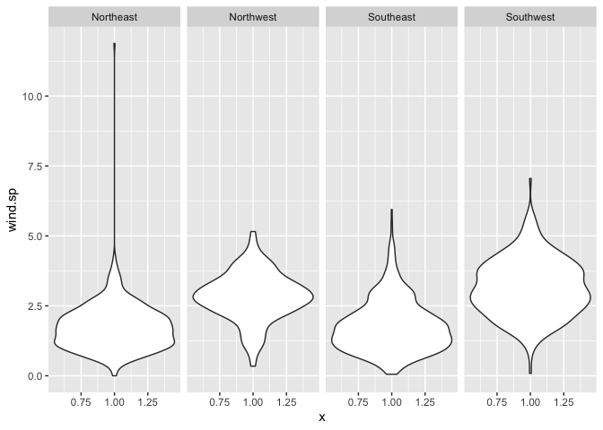
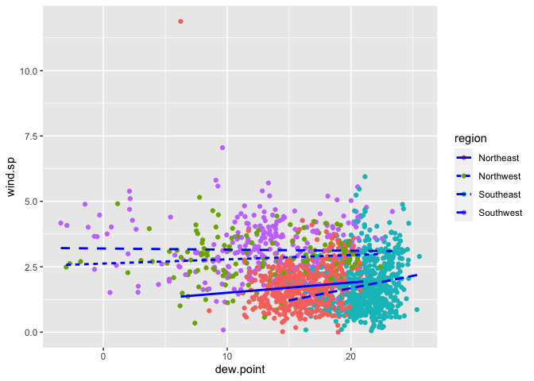
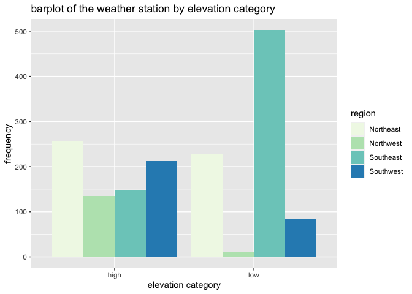
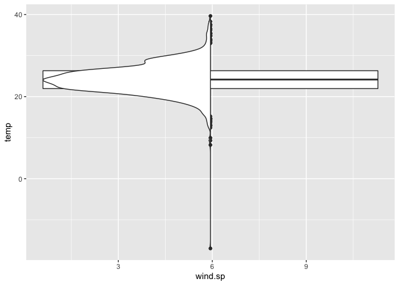

LAB4
================
Caroline
9/17/2021

## R package setup

``` r
library(data.table)
library(tidyverse)
```

    ## ── Attaching packages ─────────────────────────────────────── tidyverse 1.3.1 ──

    ## ✓ ggplot2 3.3.5     ✓ purrr   0.3.4
    ## ✓ tibble  3.1.4     ✓ dplyr   1.0.7
    ## ✓ tidyr   1.1.3     ✓ stringr 1.4.0
    ## ✓ readr   2.0.1     ✓ forcats 0.5.1

    ## ── Conflicts ────────────────────────────────────────── tidyverse_conflicts() ──
    ## x dplyr::between()   masks data.table::between()
    ## x dplyr::filter()    masks stats::filter()
    ## x dplyr::first()     masks data.table::first()
    ## x dplyr::lag()       masks stats::lag()
    ## x dplyr::last()      masks data.table::last()
    ## x purrr::transpose() masks data.table::transpose()

## Step 1: Read in the data

``` r
if (!file.exists("met_all.gz"))
  download.file(
    url = "https://raw.githubusercontent.com/USCbiostats/data-science-data/master/02_met/met_all.gz",
    destfile = "met_all.gz",
    method   = "libcurl",
    timeout  = 60
    )
met <- data.table::fread("met_all.gz")
```

## Step 2: Prepare the data

``` r
#Remove temperatures less than -17C
met <- met[temp >= -17]

#Make sure there are no missing data in the key variables coded as 9999, 999, etc
#temp, rh, wind.sp, vis.dist, dew.point, lat, lon, and elev
met[,range(temp)]
```

    ## [1] -17  56

``` r
met[,range(rh, na.rm = TRUE)]
```

    ## [1]   0.8334298 100.0000000

``` r
met[,range(wind.sp, na.rm = TRUE)]
```

    ## [1]  0 36

``` r
met[,range(vis.dist, na.rm = TRUE)]
```

    ## [1]      0 160000

``` r
met[,range(dew.point, na.rm = TRUE)]
```

    ## [1] -37.2  36.0

``` r
met[,range(lat, na.rm = TRUE)]
```

    ## [1] 24.550 48.941

``` r
met[,range(lon, na.rm = TRUE)]
```

    ## [1] -124.290  -68.313

``` r
met[,range(elev, na.rm = TRUE)]
```

    ## [1]  -13 9999

``` r
met[elev == 9999.0, elev := NA]

#Generate a date variable using the functions as.Date() (hint: You will need the following to create a date paste(year, month, day, sep = "-")).
met[, ymd := as.Date(paste(year, month, day, sep = "-"))]

#Using the data.table::week function, keep the observations of the first week of the month.
met[, table(week(ymd))]
```

    ## 
    ##     31     32     33     34     35 
    ## 297260 521605 527924 523847 446576

``` r
met <- met[ week(ymd) == 31]

#Compute the mean by station of the variables temp, rh, wind.sp, vis.dist, dew.point, lat, lon, and elev.
met_avg <- met[, .(
  temp = mean(temp, na.rm = TRUE),
  rh = mean(rh, na.rm = TRUE),
  wind.sp = mean(wind.sp, na.rm = TRUE),
  vis.dist = mean(vis.dist, na.rm = TRUE),
  dew.point = mean(dew.point, na.rm = TRUE),
  lat = mean(lat, na.rm = TRUE),
  lon = mean(lon, na.rm = TRUE),
  elev = mean(elev, na.rm = TRUE), USAFID
), by = "USAFID"]

#Create a region variable for NW, SW, NE, SE based on lon = -98.00 and lat = 39.71 degrees
met_avg[lat >= 39.71 & lon <= -98, region := "Northwest"]
met_avg[lat < 39.71 & lon <= -98, region := "Southwest"]
met_avg[lat >= 39.71 & lon > -98, region := "Northeast"]
met_avg[lat < 39.71 & lon > -98, region := "Southeast"]

met_avg[, region2 := fifelse(lat >= 39.71 & lon <= 98, "Northwest",
        fifelse(lat < 39.71 & lon <= -98, "Southwest",
          fifelse(lat >= 39.71 & lon > -98, "Northeast",
            fifelse(lat < 39.71 & lon > -98, "Southeast", NA_character_))))]

met_avg[, table(region, useNA = "always")]
```

    ## region
    ## Northeast Northwest Southeast Southwest      <NA> 
    ##       484       146       649       297         0

``` r
#Create a categorical variable for elevation as in the lecture slides
met_avg[, elev_cat := fifelse(elev > 252, "high", "low")]

#Delete extra column
met_avg <- met_avg[, -1]
```

## Step 3: Use geom\_violin to examine the wind speed and dew point temperature by region

``` r
ggplot(met_avg, mapping = aes(y = wind.sp, x = 1)) +
  geom_violin() + 
  facet_grid(~region)
```

    ## Warning: Removed 15 rows containing non-finite values (stat_ydensity).

<!-- -->

## Step 4: Use geom\_jitter with stat\_smooth to examine the association between dew point temperature and wind speed by region

``` r
met_avg[!is.na(dew.point) & !is.na(wind.sp)] %>%
  ggplot(mapping = aes(x = dew.point, y = wind.sp, color = region, linetype = region)) +
  geom_jitter() +
  stat_smooth(method = "lm", se = FALSE, color = "blue")
```

    ## `geom_smooth()` using formula 'y ~ x'

<!-- --> The wind
speed remained almost the same as the dew. point changed.

## Step 5: Use geom\_bar to create barplots of the weather stations by elevation category coloured by region

``` r
met_avg[!is.na(elev_cat)] %>%
    ggplot() + 
    geom_bar(mapping = aes(x = elev_cat, fill = region), position="dodge") + 
    labs(
      x = "elevation category",
      y = "frequency",
      title = "barplot of the weather station by elevation category") +
    scale_fill_brewer(palette = "GnBu")
```

<!-- --> The southeast
with low elevation show the highest frequency

## Step 6: Use stat\_summary to examine mean dew point and wind speed by region with standard deviation error bars

``` r
ggplot(
  met_avg[!is.na(wind.sp) & !is.na(dew.point)],
  mapping = aes(x = region, y = wind.sp)) +
  stat_summary(fun.data = "mean_sdl") +
  stat_summary(fun.data = "mean_sdl", geom = "errorbar") 
```

<!-- -->

## Step 7: Make a map showing the spatial trend in relative h in the US

``` r
library(leaflet)

temp.pal <- colorNumeric(c('light sky blue','goldenrod','brown'),
                         domain = met_avg$rh)

leaflet(met_avg) %>%
  addProviderTiles('CartoDB.Positron') %>%
  addCircles(
    lat = ~lat, lng=~lon,
     label = ~paste0(round(temp,2), ' C'), color = ~ temp.pal(temp),
    opacity = 1, fillOpacity = 1, radius = 500
    ) %>%
  addLegend('bottomleft', pal=temp.pal, values=met_avg$temp,
          title='Temperature, C', opacity=1)
```

    ## Warning in pal(c(r[1], cuts, r[2])): Some values were outside the color scale
    ## and will be treated as NA

    ## Warning in temp.pal(temp): Some values were outside the color scale and will be
    ## treated as NA

    ## Warning in temp.pal(temp): Some values were outside the color scale and will be
    ## treated as NA

<div id="htmlwidget-0ffeb473cd0ad21bebb3" style="width:672px;height:480px;" class="leaflet html-widget"></div>
<script type="application/json" data-for="htmlwidget-0ffeb473cd0ad21bebb3">{"x":{"options":{"crs":{"crsClass":"L.CRS.EPSG3857","code":null,"proj4def":null,"projectedBounds":null,"options":{}}},"calls":[{"method":"addProviderTiles","args":["CartoDB.Positron",null,null,{"errorTileUrl":"","noWrap":false,"detectRetina":false}]},{"method":"addCircles","args":[[34.2999166666667,30.784,42.543,32.2174556213018,41.425,30.383,38.583,37.186,34.545,33.636,40.747,46.417,45.417,46.682914893617,31.397,46.619,33.175,34.1,32.915,41.275,38.955,27.207,32.213,48.4670555555556,28.973,34.273,41.736,26.442,35.256,36.687,34.602,36.018,43.677,42.5740489130435,37.521,32.444,33.714,36.3610138888889,33.53,32.747,42.4530034843206,33.7799859649123,32.084,30.886,37.239,31.869,32.456,32.6459965277778,30.872,40.1,33.254,38.96,34.861,41.196,40.947,33.096,41.4,35.6130833333333,31.78,36.4139895833333,27.779,38.398,33.1100486111111,39.016,32.354,45.654,48.2990069444444,30.243,40.435,42.219,44.892,39,38.607,33.898,39.1670344827586,32.1491272727273,44.6259243697479,35.864,44.333,42.732,42.7959722222222,30.750012345679,33.598,33.154,41.226,36.611,34.699,39.6000627615063,35.538,35.95,35.4729375,31.0429927536232,31.846,42.07,45.372,43.987,43.743,41.96,27.916,34.229,35.6334545454545,41.0326610169492,36.855,30.291,30.7036423357664,38.967,39.7999649122807,45.117,47.1039166666667,31.056,34.85,34.1,28.95,39.217,35.6,33.85,41.4120868055556,38.15,39.9280555555556,39.983,36.4219789915966,41.828,34.267,40.333,43.433,39.428,37.158,37.45,39.7669583333333,36.665,37.578,37.633,38.0669684210526,37.751,30.8169479166667,30.558,36.9,46.217027972028,44.567,44.883578313253,44.933,37.4,36.783,37.85,33.902,41.824,41.4440347222222,43.548,38.698,38.2388765432099,38.783,38.533,40.0330208333333,40.333,40.5670138888889,40.167,37.283,34.383,30.5,41.3000729166667,40.6168541666667,41.384,39.18334375,35.4329930555556,36.1748333333333,41.552,40.031,38.533,32.15,32.7170277777778,40.617,26.967,42.683,29.976,44.783,30.4600208333333,41.333,29.717,34.3,34.5,33.183,34.783,33.6499823943662,33.2500286738351,34.283,33.717,34.717,32.701,34.7170629370629,34.181,32.9170139372822,34,32.4118745644599,33.8280106007067,38.909,38.0329893992933,36.533,29.8,44.016,36.75,35.883,35.283,35.483,43.663,34.6170174825175,33.063,34.4,34.315,35.3,38.3500252707581,29.5000208333333,44.095,30.533,43.235,33.417020979021,38.717074204947,37.513,31.106,30.395,36.33,40.225,38.3558888888889,28.867,30.735,31.554,29.467,33.6329861111111,39.608,41.052,40.204,33.912,29.117,28.6430243902439,28.0556443661972,28.5,43.581,30.3490782608696,41.066,47.451,30.902,32.646,35.947,34.8167985611511,36.654,33.433,31.841,31.641,32.304,39.6670277777778,38.946,48.884,46.925,48.784,34.689,48.48,44.251,48.929,48.381,35.937,48.405,47.29,48.39,47.796,46.768,46.117,43.067,29.067,48.301,46.9419722222222,27.833,27.6300520833333,29.296,48.726,34.915,30.071,40.28,45.506,31.606,46.218,41.2330277777778,32.521,40.3677418111753,30.617,32.1100138888889,37.974,32.609,26.9331041666667,29.1170416666667,40.711,32.214,30.033,32.4328762886598,33.227,30.718,35.7,42.517,35.178,35.38,31.684,30.879,31.885,43.467,28.228,32.931,39.332,30.173,29.634,44.4764497607655,46.244,43.6209936507937,43.459,27.812,24.5556802325581,28.29,28.474,24.5828939393939,24.726,25.7813551912568,28.014,26.378,25.907,25.483145631068,25.648,26.6847902097902,34.269,44.0739663299663,44.753,26.917,25.9990268456376,26.1549586206897,26.197,28.1010243902439,29.445,32.742,34.804,28.5169661016949,26.2499805194805,28.4338219178082,34.398,36.773,28.545,35.135,29.167,28.78,42.6900105263158,30.4927005988024,39.4670729166667,31.4770209059233,30.2330545454545,30.3999189189189,30.219,30.4,32.1312285714286,35.0960034722222,34.976,38.089,41.932,40.2,34.471,35.781,32.8992206896552,39.4170282485876,42.246,32.482954887218,40.9331041666667,31.8831948051948,36.2939756944444,36.6050489510489,44.68,32.699,36.682,35.9765833333333,41.584,40.96,35.724,37.45,27.498,27.765,26.5850117647059,32.675,26.536,34.3168229166667,27.9629554140127,32.699,30.169,45.159065625,27.4007446808511,27.911,27.072,27.9999329268293,29.6340526315789,32.693,27.9499345794393,40.1490104166667,43.433,41.5399826388889,41.121,35.483,46.839,31.25,35.541,35.389923566879,35.438,32.193,31.259,31.152,30.368,30.3997086614173,36.023,44.523,32.579,45.2363672456576,45.426,31.083,35.417,41.352,41.35,36.4371666666667,34.722,39.2170416666667,34.123,40.52,26.179,31.536,35.668,34.979,30.783,38.247,44.779,31.3829861111111,32.6877403314917,40.924,39.7,34.167,32.633,33.312,35.195,35.0210104166667,45.149972027972,33.3643461538461,33.467,41.893,45.823,34.2720268456376,35.3570034722222,35.2119369369369,27.182,33.6322666666667,33.929,32.473,36.285,40.293,33.779,33.8750135135135,33.3550437956204,36.2,35.929,29.7329333333333,35.582,29.211,38.483,42.046,28.654,30.483,41.964,29.959,28.8210242424242,35.858,30.78,32.564,38.5330415224914,41.0370069444444,30.478,30.350125,30.717106870229,30.6874405594406,31.666,30.6260175438596,31.35,31.356,42.242,34.891,38.981,30.65,40.624,30.131,39.531,32.35,32.514,44.7293663366337,32.756,32.516,42.0980416666667,32.3,27.2669861111111,32.383,31.860985915493,31.317,31.2670535714286,33.9169124087591,40.684,31.309,31.416,34.653,33.5659732142857,32.6159923076923,33.9670454545455,33.212,33.587,40.948,33.178,29.9954113475177,30.5210173611111,30.038,30.049,29.81732,31.736,30.5369322033898,37.033,31.417,32.036,29.7168396946565,30.3430175438596,42.4709405204461,45.469,38.0970520833333,30.833,27.349,32.3348085106383,29.2961754385965,42.351,32.55,42.9920760869565,31.467,32.3201048951049,29.2657083333333,32.337,32.233020979021,31.616856,31.1829032258065,29.0540882352941,33.167,29.947,34.681,38.783,35.55,27.917,31.0496846846847,30.1267534246575,29.562,30.210025477707,30.205,29.5660526315789,29.9508814814815,29.7089607843137,29.273,29.518963963964,30.0679393939394,29.9783247863248,29.616156626506,29.638067961165,30.3569489795918,31.236,30.744,32.354,32.0309411764706,32.3849895833333,32.664,32.44775,32.543,32.5,32.5158230088496,31.395,32.35,32.7099814814815,31.578,26.228,26.184,26.166,27.775252173913,27.6830970873786,27.5000714285714,27.741,27.9001129032258,27.5331145833333,29.339,28.0840526315789,28.457,29.11,29.5411384615385,29.36,29.3830660377358,29.5329433962264,29.983,29.8910576923077,30.1992782608696,33.19,30.74094,29.622,30.3209900990099,30.679,28.8597246376812,33.651,28.725,31.6186551724138,31.485,31.1338793103448,31.0830576923077,31.067,31.1500594059406,32.8519038461538,33.6330350877193,33.068,33.2059572649573,32.8984637681159,32.565,32.973,32.7670208333333,32.782,32.969,32.681,32.215,29.3763571428571,29.36675,30.0479375,30.9121237113402,31.8309896907216,31.3540338983051,35.8999826388889,30.371,31.921,31.9482831858407,31.78,32.4118421052632,31.7999581881533,33.6637543859649,32.853,35.003,36.7410157480315,33.3067719298246,33.4500909090909,34.3837142857143,32.3340297029703,32.6927905759162,34.43244,32.2,38.5859479166667,32.84,32.2830416666667,31.8084571428571,33.2365151515151,31.458,32.633,32.262,31.4209752066116,31.5879685534591,32.1443793103448,32.1669903846154,32.855,32.9503608247423,33.269,35.658,33.4287666666667,33.4668823529412,33.688,33.5489285714286,33.3005294117647,33.5273272727273,33.4171904761905,33.623,32.817,31.607,38.767,31.3997321428571,31.0226554621849,48.941,33.8998020833333,33.8222474226804,33.952,34.0237473684211,34.201,34.016,34.21,34.0992727272727,34.6669939759036,35.237,33.975,32.7338823529412,32.816,32.572,32.826,32.567,33.023,33.3000701754386,33.128,33.286,32.8670223880597,33.219,33.9373798449612,35.0668586572438,33.8029285714286,33.923,33.8126666666667,39.163,33.79,33.872,33.6799674796748,35.742,34.2678106508876,35.173985645933,35.0331105990783,34.991,34.7330076923077,35.9170072727273,35.765,35.889037037037,35.6330138888889,35.3438203592814,35.3175798816568,35.855,34.833,36.261,36.0280173010381,36.817,36.298,36.9023766233766,36.698,37.7080084745763,36.937,37.132,37.133,34.9000066666667,35.068,34.708,34.6831567164179,38.527,33.9430158730159,33.9709661016949,33.96628125,34.187961038961,33.587,34.792,33.9482191780822,38.01,33.462,34.4652608695652,34.9870136054422,34.672,34.8460434782609,34.8871801242236,34.758,46.15,34.249,35.233,35.2226,35.237,35.428,36.432,35.197,35.821,35.4321100917431,35.646,31.536,36.223,36.0940331125828,34.98806,36.047,36.46,34.498,36.134,35.0170136054422,34.3482875816993,34.6445774647887,34.679,34.744032,35.0338897058824,35.554,35.951,35.8177837837838,36.1432251655629,36.009,36.056,36.6239473684211,35.3504228187919,37.225,36.773,33.65,33.45,34.262688,35.054693877551,35.5930603448276,36,36.4799596774194,34.7270208333333,34.9170208333333,36.125,35.8310097087379,35.9668421052632,35.94,34.29,34.6,34.1799285714286,33.454,33.221,33.6170208333333,35.258,36.1674029850746,34.5470285714286,36.2829820359281,36.369,35.333,41.7299826388889,36.191,36.3498195488722,36.01,36.291,35.726,36.372,36.2669626865672,36.878,37.152,33.9774833333333,34.65,34.989,35.357,34.344,35.3876086956522,36.333,36.3829772727273,35.8519459459459,35.4169813084112,35.534,36.162,34.65,34.3000114285714,35.657,36.1991059602649,36.039,36.768,34.882,35.2499542857143,34.558,36.449081300813,34.067,35.165,36.399,35.5139743589744,31.1780104166667,30.069,35.2269185185185,35.6951212121212,35.145,35.040243902439,35.8829270833333,35.617,36.744,34.427,36.4503669724771,35.1820101010101,35.654,35.2592564102564,36.9269911504425,34.6520163934426,35.0264590163934,34.257,34.2640068728522,35.1422518518519,34.518,34.8499588014981,45.497,33.909,30.5159756944444,34.607,35.946,35.157,34.768,34.9013333333333,34.854,34.741,34.629,34.7448571428571,35.4338571428571,36.0735462184874,36.6204159292035,36.7780714285714,37.6329375,36.3170416666667,36.319,34.1170196078431,34.426,34.2169696969697,34.201,34.717,34.89908,35.67,38.341,40.195975,36.666,36.682,37.510325203252,37.183,38.1370680272109,37.358,36.983,37.9365294117647,37.647,38.9412047244095,38.267,38.5039826086957,38.721,38.7169814814815,38.2998823529412,38.804,38.8477260273973,39.143,39.078,36.895,39.4716470588235,36.6830555555556,39.1743125,39.7060327868852,39.3326956521739,39.4517664233577,39.941,39.3660142857143,41.009,39.8743223140496,40.183,40.079,39.133,40.033,38.69,40.876,40.277,40.0169906542056,40.7999636363636,37.3222972972973,38.264,36.573,36.766,37.317132231405,37.208,37.9500037593985,37.1330555555556,36.988,36.688,37.7839315068493,37.298,37.867,38.376387755102,38.8848644067797,39.2960060606061,39.643,39.4039365079365,39.674,37.5909927007299,40.8200306122449,39.0448938053097,38.0398571428571,38.1815,38.1849375,38.228,37.75,37.8001649484536,37.9000578512397,37.086962962963,38.3654024390244,36.0229508196721,39.34,40.1759863945578,39.5939489795918,39.9923982300885,39.9000103626943,39.817,39.944,41.5630625,40.0780204081633,39.89621875,39.756,39.84,39.4309724770642,39.103,40.708,41.038,38.0447946428571,38.65,38.323,37.78,38.5499479166667,37.7500260416667,38.7525178571429,38.657,37.057408,37.0539965277778,39.578,39.2669253731343,38.249,39.452,39.1331354166667,39.72675,39.825,40.11696,40.412,40.528,41.5329339622642,39.845,38.8833333333333,40.483,37.2392328767123,38.1319479166667,39.937125,38.8170234375,38.704,37.761,40.097,37.7499285714286,38.591,38.096,39.2938671328671,39.121,39.823,38.7171274509804,38.8499672131148,38.832,39.7739423076923,37.6482176870748,37.1680060240964,37.7460258064516,37.6170177304964,38.065,37.6699878787879,39.0080361445783,38.0675683453237,37.7650256410256,37.927,37.05,38.3499558823529,38.8495912408759,37.0910559006211,37.2839583333333,36.7369056603774,39.05,39.1350379746835,38.3290193548387,39.0724845360825,38.95,39.5509120879121,38.876,38.8,37,37.438232,37.1429756097561,37.9500555555556,38.0490103092784,38.07,38.2890655737705,37.2619736842105,37.2829693877551,39.367025,39.3760243902439,38.81,39.2749834710744,39.57,39.229,40.0441,39.6494455445545,39.23,38.533,40.517,38.678,39.245,39.7840706521739,39.717,40.167,39.9007005988024,39.609,28.817,38.4261184573003,37.1,37.7087913043478,37.706,39.1311379310345,38.506,37.307,40.436,40.4500606060606,39.6009896907216,38.75,41.7870833333333,38.417,37.3704285714286,37.3827125748503,37.285,38.3779791666667,38.5070659340659,38.5662207792208,38.6670421052632,39.1330566037736,39.1019583333333,38.69596875,36.212,38.051,39.2957391304348,39.4862857142857,39.417,36.5879946236559,37.8905714285714,37.6240416666667,37.693,37.721,37.4667272727273,37.5168275862069,37.6196335877863,37.359,37.333,37.9919791666667,38.21,38.5040806451613,39.7997674418605,37.064,42.571,41.073,41.509,40.822,40.685203125,33.861,40.85,41.51,41.4828655462185,40.7799618320611,41.626,41.067,41.5,41.1592631578947,41.264,41.3280163934426,40.7790188679245,41.921,42.47,41.2527125748503,41.650275862069,41.9099716981132,41.676,41.393,41.669,41.876,41.688,41.7244159292035,42.072,41.597,42.6969863013699,41.533,41.9373103448276,41.742,42.57,41.3710247933884,41.7360280373832,42.584,42.362546875,42.191,42.271,40.3731417322835,41.626,40.821,42.552,40.2380535714286,40.3300280373832,39.918,40.1200135135135,40.1330175438597,40.217,41.047012195122,40.777,41.179,40.296,40.316,40.8499723756906,41.3338120805369,41.2437417218543,40.433,41.7010438596491,43.35,42.2062222222222,42.4836095238095,42.159,42.109,43.533,40.6500149253731,36.695,40.6329860627178,42.7348620689655,43.1123913043478,42.643,43.234,40.4928167938931,40.7680340136054,40.3549850746269,40.2827784810127,40.616,40.9178571428571,41.3459591836735,40.873,39.364,43.338,40.472,40.0230701754386,41.40884375,41.518,41.5669220779221,41.2566859504132,41.217,41.338,41.778,34.594,42.0804210526316,41.8,41.3829673202614,42.9391037037037,42.241,43.10799,43.117,41.716972027972,35.0170277777778,41.9656696428571,41.9139375,38.571,40.04,39.83403125,39.478,40.6676899224806,41.743,41.453,40.9739291338583,40.6499099099099,40.234,41.6169797297297,41.7855714285714,38.764,41.5,42.417,41.604,41.7084285714286,41.717,41.5864482758621,41.014,42.2275912408759,42.099,42.223,42.409,42.2331,42.608,42.6290729166667,41.8166344086021,42.911,44.0219583333333,47.46703125,42.7747142857143,42.746,42.2668653846154,42.308,41.868,43.322,43.78,45.013,45.9823725490196,41.921,41.933,42.251,43.7174578947368,42.566,41.94,40.783,43.622,42.1940178571429,41.139,41.4628571428571,41.883,41.407,41.276,40.46,43.078,42.742,41.5338584070796,42.111,41.633,43.073,41.674,41.108,41.691,40.7510034965035,42.046,41.0190104529617,42.3983571428571,41.9910671641791,41.8328541666667,41.0073902439024,42.223972027972,43.2750174216028,41.986,42.4360070175439,40.722,42.5534285714286,40.659,42.778,43.1540338983051,42.049006993007,41.3670104166667,42.681,42.5500198019802,41.299,41.0100034843206,43.208,42.597,41.259,41.7000105263158,40.6309905660377,41.3085714285714,40.8508947368421,40.8940208333333,40.893,38.142,40.301,40.961530927835,41.623,40.6010245398773,40.7323142857143,41.764,40.08,41.117,40.606,41.433,42.5770208333333,41.9857,41.449,41.4331013513514,42.47,42.3931428571429,41.099,41.1202426035503,41.119,40.789,40.206,40.5099854014599,40.4500625,42.0569496855346,42.8370085470086,41.1569923664122,41.316953271028,39.8404466666667,41.8706081081081,41.1889965156794,42.8784624277457,42.796,42.9009821428571,40.4947538461538,40.443,40.4796875,39.5279583333333,40.7792121212121,40.219,41.595,41.196,41.11765625,42.815,42.061,41.2730377358491,43.6000538461538,42.9196190476191,46.1439583333333,43.51896,40.068,40.7208217821782,40.829,40.9016782608696,40.6117743055556,39.2769583333333,39.3199587628866,38.898,37.654,44.889,43.500125,42.482,42.5420202020202,42.147,39.126,40.1516964285714,40.5154285714286,36.664,40.978,41.78,41.781,41.333,41.491,42.3772265625,42.6,42.1665,42.074,43.2041351351351,43.0829065420561,43.278,43.6439692307692,43.394,44.79845,44.533,44.45,44.067,47.286,44.534015503876,43.344,43.626,44.27,44.42,44.204,43.567,44.576,42.805,44.368,42.9,42.8939591836735,44.4678253968254,43.991,44.05,44.316,45.462,45.648,44.936,44.6500208333333,43.9888899082569,44.385,46.3502985074627,42.8829538461538,42.1260173913043,42.235,41.703,43.1704285714286,43.963,42.9669915966387,42.6650303030303,43.533,44.3595777777778,44.2822452830189,44.267034965035,44.741,45.0708732394366,38.7801795774648,39.4302195121951,46.311,44.4500989010989,39.05,42.9541578947368,45.928,43.1090534759358,43.041,43.1399841269841,43.4170526315789,42.615,42.6171111111111,43.212,45.101,45.308013986014,46.549,42.761,43.7690173913043,44.55,46.6890105263158,43.879,44.867,43.933,43.967,43.156,43.9059642857143,43.019,45.199,44.4838,44.3590175438597,44.133,43.984,44.2655649350649,44.85,44.929,43.167,44.7825987654321,45.2280579710145,45.419,45.709,45.7324166666667,45.1174464285714,41.053,43.4011875,43.164,44.614,43.522,45.932,42.5950338983051,43.769,42.887,46.026,43.426,43.5786896551724,43.733,44.300101010101,44.051,43.021,43.3909012345679,45.6689793814433,42.8803669064748,43.7669965277778,45.032,44.3954864864865,48.016,43.774,44.905,45.644,48.941,47.822,45.543,44.969,46.4049457364341,44.548,45.8679215686275,46.7028088235294,44.4500729166667,44.3810243902439,46.4472977667494,44.628,44.589,45.566,43.983,44.3191214285714,44.123,44.8590987654321,46.2830860759494,44.6379916666667,45.062,45.1498888888889,45.9491012345679,44.831898989899,44.883,45.1421948051948,44.932,44.2171132075472,43.6495625,43.645,44.077,43.6828710601719,45.4437814569536,43.65,44.018,44.857,44.482979020979,44.0434046242775,44.15,45.154,45.6039591836735,44.339,44.381,44.7687419354839,44.5439166666667,43.966,44.517,47.133,45.698,45.56,45.5460072463768,41.8,44.51709,42.584,43.0644137931034,44.6830173611111,45.8054044117647,47.049,46.357603960396,45.787720338983,45.698,43.567,43.6498333333333],[-116.165916666667,-98.662,-83.178,-80.6998047337278,-88.419,-103.683,-91,-88.751,-94.203,-91.756,-122.922,-86.65,-123.817,-122.983,-84.895,-93.31,-97.828,-82.817,-85.963,-85.84,-121.081003472222,-98.121,-101.521012658228,-122.416069444444,-95.863,-78.715,-83.655,-98.1289756944444,-81.601,-77.483,-78.578,-75.671,-92.18,-84.811,-76.765,-97.817,-96.674,-78.529,-82.516,-96.531,-91.948,-82.816,-97.097,-94.035,-76.716,-95.218,-96.9129791666667,-81.596,-96.622,-75.267,-97.581,-94.371,-86.557,-96.112,-91.511,-94.9610104166667,-92.946,-100.995729166667,-95.706,-100.74903125,-97.691,-77.456,-98.555,-87.65,-97.434,-84.519,-116.56,-98.91,-75.382,-92.026,-91.868,-80.274,-87.727,-117.602,-77.1669655172414,-111.167872727273,-86.201,-98.421,-89.02,-95.556,-109.806027777778,-92.688012345679,-83.139,-83.241,-92.491,-83.7379861111111,-99.338,-78.7669748953975,-98.933,-96.773,-98.005875,-86.312,-86.611,-124.29,-94.7461031941032,-95.783,-111.097,-85.593,-82.449,-86.256,-91.1678181818182,-80.4168305084746,-84.856,-87.672,-87.0226423357664,-76.333,-105.765985964912,-95.133,-122.286916666667,-82.7671215277778,-102.333,-93.066,-98.517,-82.233,-92.45,-98.483,-96.1091388888889,-122.55,-74.2920888888889,-75.867,-105.29,-94.16,-87.6,-82.517,-86,-101.046,-95.778,-94.733,-101.799972222222,-88.373,-84.77,-84.333,-83.9829894736842,-82.637,-89.8669652777778,-92.099,-94.017,-97.6331398601398,-72.017,-72.2326144578313,-73.1,-77.517,-76.45,-76.883,-87.314,-110.556024305556,-106.826895833333,-109.69,-106.07,-108.563082304527,-108.067,-106.05,-105.21703125,-103.8,-102.267041666667,-105.167,-107.05,-89.5499405594406,-97.967,-85.06696875,-103.266854166667,-72.506,-119.733038194444,-99.3999791666667,-96.1519583333333,-112.062,-86.251,-121.783,-94.85,-98.8919861111111,-74.249963099631,-99.25,-90.45,-92.084,-88.55,-87.877,-86.667,-95.383,-81.633,-81.95,-80.033,-81.2,-81.6830352112676,-81.3830179211469,-80.567,-79.850049122807,-79.95,-80.003,-80.8500524475524,-79.335,-80.6330278745645,-80.367,-80.6339895470383,-79.122,-121.351,-120.416992932862,-93.2,-95.9,-97.086,-97.35,-101.033,-95.1,-97.817,-84.261,-79.7330034965035,-80.279,-80.117,-81.109,-112.2,-93.6830036101083,-95.477,-121.2,-98.367,-93.624,-112.683020979021,-120.75003180212,-122.501,-98.196,-97.567,-77.635,-83.352,-119.518962962963,-82.5670418118467,-101.203,-81.883,-81.217,-85.1500138888889,-77.008,-93.689,-84.532,-84.941,-89.55,-89.7940209059233,-95.8734683098591,-95.7160034722222,-116.523,-85.7880956521739,-86.182,-99.151,-83.881,-93.298,-114.861,-82.7000863309352,-83.218,-88.849,-99.404,-96.514,-90.411,-119.876,-104.57,-99.621,-103.982,-97.632,-86.006,-99.236,-90.855,-103.297,-102.898,-77.547,-97.371,-101.581,-100.024,-103.254,-100.894,-89.883,-83.2674293628809,-81.2830173611111,-102.406,-98.018,-91.983,-90.45,-88.842,-116.295,-88.604,-94.216,-83.115,-91.981,-90.409,-100.245,-96.5999791666667,-94.308,-83.8172967244701,-81.467,-84.189,-92.691,-82.37,-94.6831041666667,-90.2000138888889,-86.375,-83.128,-85.533,-99.8500515463918,-84.275,-91.479,-79.5,-108.783,-86.066,-86.246,-83.27,-96.971,-82.647,-108.386880701754,-82.156,-96.435,-94.31,-90.941,-104.361017361111,-93.0164497607656,-96.607,-96.2160253968254,-83.4459408450704,-97.089,-81.7541569767442,-81.437,-82.4540189873418,-81.6830909090909,-81.052,-80.3285409836065,-82.345,-80.108,-80.2799724137931,-80.3830242718447,-80.433,-80.0991048951049,-86.858,-93.553,-95.556,-81.991,-80.241,-81.775,-80.171,-80.644012195122,-90.261,-95.496,-96.671,-80.7999830508475,-80.1080194805195,-81.323904109589,-96.148,-98.67,-81.333,-90.234,-82.233,-81.244,-88.3040105263158,-81.6951497005988,-106.15,-82.8609790940767,-81.6672545454545,-81.4170720720721,-81.8760071942446,-86.4719814814815,-81.2017714285714,-97.9660069444444,-78.364,-88.123,-88.708,-87.6,-97.95115625,-80.304,-80.0392344827586,-77.3827457627119,-89.582,-80.717045112782,-90.4329583333333,-81.5668376623377,-95.4790243055556,-94.7380244755245,-84.729,-97.047,-101.505,-115.132083333333,-95.3390069686411,-72.252,-96.82,-106.8,-80.377,-82.627986013986,-81.8610117647059,-102.654,-81.755,-84.417,-82.5386624203822,-94.949,-96.98,-93.842803125,-82.5587872340426,-82.688,-82.44,-82.0498109756098,-83.1047368421053,-100.95,-81.783,-97.587,-83.8665108695652,-87.5319930555555,-87.846,-81.161,-96.6630898058252,-82.4,-78.39,-80.707076433121,-94.803,-82.3719930555555,-81.466,-81.391,-89.455,-84.3461732283465,-78.33,-114.215,-96.719,-93.9863672456576,-84.913,-83.8,-80.151,-89.153,-71.799,-99.5210104166667,-84.869,-104.632958333333,-84.849,-90.652,-97.974,-84.194,-95.949,-89.787,-83.277,-78.046,-95.033,-103.510013888889,-83.6524254143646,-88.625,-87.6690034722222,-101.716,-83.6,-84.77,-83.8649930555555,-94.621,-92.5330699300699,-81.9634166666667,-82.039,-89.078,-92.373,-83.83,-96.943,-91.7370630630631,-80.221,-84.4391333333333,-78.075,-100.466,-78.984,-88.142,-84.521,-84.302,-84.5671094890511,-81.65,-95.0040138888889,-85.03292,-79.101,-99.744,-106.316,-90.108,-96.681,-86.517,-100.568,-81.34,-81.8099878787879,-102.013,-86.523,-82.985,-76.0329792387543,-107.492034722222,-87.187,-87.3170833333333,-87.0170763358779,-88.2464475524475,-98.149,-88.068,-85.667,-85.751,-96.983,-79.759,-76.922,-86.523,-74.669,-93.376,-84.395,-85,-92.5880694444444,-96.2660915841584,-91.881,-84.942,-70.6718958333333,-86.4064294478528,-80.85,-86.3503096774193,-86.012,-85.45,-85.7169761904762,-84.5169562043796,-92.901,-86.394,-87.044,-86.945,-86.7450803571429,-85.4330076923077,-86.0830454545455,-87.616,-85.856,-95.917,-86.782,-90.2748226950355,-90.418,-91.884,-90.029,-90.01772,-93.099,-91.1470508474576,-85.95,-97.8,-102.101,-91.3331374045802,-89.8219912280702,-93.2078921933085,-89.806,-106.168034722222,-93.333,-98.737,-88.7445957446809,-81.1130350877193,-86.256,-88.567,-84.1384456521739,-89.3330240963855,-90.0791188811189,-96.0115486111111,-90.221,-90.9329825174825,-91.283672,-90.4710193548387,-80.948,-95.617,-100.173024305556,-90.347,-93.8,-98.667,-97.2,-93.1835675675676,-93.2255890410959,-91.526,-93.143,-91.988,-90.66,-94.0205259259259,-98.0459607843137,-94.859,-95.2421441441441,-95.5559696969697,-95.3581452991453,-95.1663253012048,-95.2819708737864,-95.414,-94.754,-95.586,-95.403,-96.3990392156863,-94.7119895833333,-97.094,-93.82625,-93.745,-93.667,-92.0408938053097,-92.291,-91.028,-96.267,-94.7090190476191,-97.654,-98.254,-97.346,-97.5103304347826,-97.2830776699029,-97.8169285714286,-98.025,-98.0502258064516,-99.4669479166667,-98.472,-97.0459824561404,-99.2180404040404,-95.462,-98.4796,-99.1740625,-98.5828679245283,-98.262320754717,-99.083,-97.8639711538462,-97.6827826086957,-96.591,-98.23512,-95.657,-97.760099009901,-97.679,-96.9284927536232,-97.197,-96.254,-97.2265086206897,-97.3160612244898,-97.717,-97.6830576923077,-97.833,-97.4168217821782,-96.8559230769231,-95.4500087719298,-96.065,-97.1989914529915,-97.0222463768116,-97.308,-97.318,-97.4499166666667,-98.06,-96.836,-96.868,-98.178,-100.925571428571,-100.78284375,-102.213,-102.916,-104.808020618557,-100.495677966102,-100.400013888889,-104.016103092784,-102.386,-102.204460176991,-103.201,-99.6821403508772,-98.9500418118467,-101.822157894737,-104.467003484321,-105.662,-104.502,-104.511912280702,-105.516132867133,-103.315571428571,-104.25804950495,-103.212209424084,-103.08272,-81.87,-77.7111041666667,-105.990021126761,-106.916041666667,-106.380735714286,-107.267878787879,-109.606,-108.166,-107.72,-110.845024793388,-110.344,-110.951965517241,-110.883,-109.635,-111.766072164948,-111.811887096774,-109.061,-112.005016666667,-111.732901960784,-112.081042553191,-112.367214285714,-111.665272058824,-112.295,-112.382777777778,-111.910009174312,-115.683,-110.428,-104.3,-93.2819017857143,-92.9115798319328,-97.903,-117.25009375,-116.504092783505,-117.438072916667,-118.290305263158,-118.357,-118.451,-118.489010416667,-117.782909090909,-120.466012048193,-120.641,-117.636020618557,-117.181117647059,-117.139024590164,-116.979007042254,-116.972,-117.116025641026,-118.588,-117.350350877193,-117.279014814815,-117.456,-117.133223880597,-117.349,-118.389488372093,-118.150035335689,-118.339232142857,-118.334,-118.146542635659,-89.675,-118.051042735043,-117.978,-117.866016260163,-81.382,-77.9,-79.009023923445,-79.4999447004608,-78.88,-76.6570307692308,-75.6999854545455,-80.9569583333333,-78.7821185185185,-77.3830138888889,-77.9648562874251,-77.6320059171598,-77.893,-77.617,-76.175,-76.5670519031142,-76.033,-77.171,-76.1936623376623,-76.9030176678445,-77.4340254237288,-76.289,-76.493,-76.6004426229508,-76.8829866666667,-77.048,-77.44,-77.0329328358209,-77.859,-81.117873015873,-80.9958898305085,-80.800015625,-79.7309090909091,-80.209,-79.366,-83.3267945205479,-77.97,-80.858,-79.89,-81.0579863945578,-82.886,-82.3460869565217,-82.2202049689441,-82.376,-89.217,-82.159,-75.622,-80.9506,-79.391,-81.935,-81.4190034722222,-81.156,-81.611,-82.5389174311927,-80.52,-82.507,-81.098,-79.9444834437086,-117.86398,-79.477,-80.553,-82.71,-80.222,-80.6209931972789,-85.1615490196078,-86.7837042253521,-86.685,-87.60032,-85.2,-87.179,-85.0810273972603,-83.9853513513514,-86.6593973509934,-86.52,-85.531,-87.4188947368421,-89.8671812080537,-89.571,-90.325,-88.45,-88.583,-88.77048,-89.9898231292517,-88.9169913793103,-89.40853125,-82.399064516129,-92.23884375,-92.1499375,-90.9240306122449,-90.646,-89.9496842105263,-89.831,-93.06,-91.5740625,-91.9340204081633,-94.0068350515464,-92.814,-92.7669861111111,-93.095,-94.1170895522388,-93.5780190476191,-94.300125748503,-92.4700096153846,-94.3638205128205,-98.0540347222222,-94.491,-94.2170902255639,-94.169,-92.59,-91.647,-94.107,-93.1569850746269,-91.903,-94.4950223880597,-98.4916583333333,-99.267,-99.053,-99.204,-98.983,-97.600768115942,-97.917,-97.7999488636364,-97.414054054054,-97.3830373831776,-97.647,-97.089,-98.4000185185185,-97.0169085714286,-95.361,-95.8865761589404,-95.984,-96.026,-95.783,-97.4670571428571,-98.417,-103.152837398374,-106.9,-107.902,-76.016,-108.793957264957,-99.324,-93.80393728223,-101.707081481481,-101.39497979798,-106.795,-106.615390243902,-106.282659722222,-106.088017241379,-108.229,-100.283,-105.666275229358,-103.603,-105.141016666667,-113.935452991453,-111.447424778761,-112.42,-110.721754098361,-111.339,-110.006993127148,-111.666548148148,-109.379,-111.783205992509,-91.0009824561403,-94.859,-96.704,-120.075027777778,-112.154,-114.559055813953,-114.618,-117.866078431373,-116.785,-118.211,-118.083,-118.725285714286,-119.053428571429,-115.163445378151,-116.025637168142,-119.718696428571,-118.849916666667,-119.399854166667,-119.628,-119.116032679739,-119.841983333333,-119.083083333333,-119.206,-120.566,-120.44816,-120.628,-75.513,-76.771925,-76.321,-76.602,-77.3242520325203,-77.5,-78.4549319727891,-78.438,-77.001,-75.468,-75.761,-77.4516771653543,-77.449,-77.305,-77.515,-77.1829814814815,-76.4169579831933,-76.069,-77.034602739726,-78.144,-77.5579861111111,-81.35,-76.1699411764706,-82.033,-76.681375,-77.7299836065574,-76.4168695652174,-74.567,-74.841,-75.0779571428571,-74.736125,-75.2300413223141,-74.133,-75.013,-75.467,-74.35,-75.363,-74.283,-74.816,-74.5999252336449,-74.4169272727273,-79.2062432432432,-78.896,-79.335,-80.8230104166667,-79.9730909090909,-80.408,-79.8170639097744,-80.6829305555556,-82.53,-78.054,-81.1223561643836,-81.204,-80.4,-81.5921768707483,-79.8527966101695,-80.2289939393939,-79.916,-77.9462698412698,-75.606,-83.3139708029197,-82.5179693877551,-84.6712566371681,-84.6051428571429,-85.7375,-84.9030416666667,-85.664,-87.167,-87.6830618556701,-85.967041322314,-84.0770592592593,-82.5540426829268,-84.2339344262295,-81.444,-80.6469863945578,-84.2259897959184,-82.8781150442478,-83.1330414507772,-82.933,-81.892,-83.4761875,-83.0779489795918,-84.1935,-82.657,-83.84,-83.7771376146789,-84.419,-84.027,-81.4640309278351,-87.5228125,-88.967,-88.858,-89.25,-89.84984375,-89.0000572916667,-90.3728839285714,-90.656,-88.773104,-84.6150034722222,-85.803,-85.8999402985075,-86.954,-87.309,-86.617,-86.278625,-86.296,-85.61698,-86.937,-86.059,-85.7830943396226,-89.684,-90.0498095238095,-88.95,-93.391095890411,-91.7650520833333,-91.1920625,-92.217796875,-93.183,-90.4280824742268,-92.543,-92.1499196428571,-92.156,-92.5529622641509,-94.7352517482517,-94.597,-93.579,-93.5499803921569,-94.7389836065574,-94.89,-94.922625,-97.4303265306122,-97.0370060240964,-97.221,-97.2670035460993,-97.861,-95.4840121212121,-95.2120602409639,-97.275,-99.9677692307692,-100.724,-100.966,-98.8669411764706,-99.2673065693431,-95.5661118012422,-98.55296875,-97.1019622641509,-96.767,-96.6789493670886,-96.1949741935484,-95.6252371134021,-95.664,-97.6509120879121,-98.809,-97.65,-101.883,-105.861768,-107.76,-107.900111111111,-103.511969072165,-102.688,-104.498245901639,-104.337035087719,-102.613071428571,-101.6920375,-99.8300081300813,-104.688,-103.666,-104.848018518519,-106.316,-107.88796,-106.916158415842,-106.87,-106.933,-106.866,-104.756007518797,-102.284,-104.537423913043,-104.75,-103.216,-105.116077844311,-110.754,-82.317,-113.01244077135,-113.6,-113.094130434783,-112.145,-108.536267241379,-107.898,-108.626,-104.631,-105.015848484848,-116.005051546392,-109.762,-111.852979166667,-113.016,-118.359285714286,-120.566191616766,-120.512,-121.957104166667,-121.494978021978,-121.299805194805,-121.400042105263,-121.433075471698,-121.56703125,-121.5890625,-115.195,-117.09,-114.845408695652,-119.772714285714,-118.715234693878,-121.844989247312,-121.228571428571,-120.950083333333,-121.814054054054,-122.220008474576,-122.115954545455,-122.25,-122.366320610687,-121.924,-121.816056603774,-122.055020833333,-122.284,-122.810048387097,-121.850372093023,-89.2190034965035,-77.713,-71.923,-74.265,-72.869,-74.16875,-90.758,-74.061,-72.828,-73.1330672268908,-73.8767709923664,-73.882,-73.708,-74.1,-73.1295614035088,-72.887,-72.0489672131148,-73.9690188679245,-71.491,-71.289,-70.1190598802395,-70.5171379310345,-70.729,-70.958,-70.615,-70.28,-71.021,-69.993,-71.433,-70.221,-71.412,-73.17,-71.283,-72.6821379310345,-72.184,-72.2909880239521,-73.4829752066116,-72.6509439252336,-70.918,-71.007421875,-71.174,-71.873,-75.9591417322835,-80.215,-76.864,-71.756,-75.5550535714286,-75.1229906542056,-76.874,-76.2940135135135,-80.2830409356725,-76.851,-78.412006097561,-79.95,-78.893,-78.32,-78.834,-77.8499723756906,-75.7248255033557,-76.9214701986755,-76.567,-74.795,-76.385,-75.9803333333333,-76.4663142857143,-76.892,-77.992,-72.95,-75.4461492537313,-76.136,-79.1000836236934,-73.7992206896552,-76.1030724637681,-77.056,-75.4119494949495,-80.2147328244275,-80.3984489795918,-79.9221194029851,-79.4001582278481,-83.06398,-81.4448571428571,-82.1789795918367,-81.887,-84.5249381443299,-73.61,-81.424,-82.4629649122807,-81.85146875,-81.68396875,-81.4831168831169,-80.6752727272727,-81.25,-84.429,-80.696,-83.296,-80.1821403508772,-78.633,-79.866954248366,-78.731437037037,-78.371,-78.93808,-77.6755964912281,-92.7001223776224,-80.0829583333333,-87.9268125,-88.24603125,-90.1569791666667,-88.278,-88.866,-88.28,-89.6838914728682,-89.676,-87.006,-85.2045354330709,-86.1500900900901,-85.394,-87.4169189189189,-87.7517142857143,-87.606,-88.167,-87.867,-88.085,-86.3161428571429,-85.983,-83.8051724137931,-83.669,-83.335598540146,-83.161,-83.7440353982301,-83.01,-83.53294,-82.818,-83.984,-85.4335483870968,-82.529,-82.7929375,-87.88296875,-84.6,-86.097,-84.4668461538461,-85.251,-84.0789405940594,-84.688,-82.9859876923077,-84.701,-86.182137254902,-84.586,-85.053,-84.9559184782609,-85.5003052631579,-84.4322582417582,-83.435,-91.125,-84.737,-89.0940357142857,-75.379,-90.5197142857143,-91.717,-95.047,-91.673,-91.428,-94.272,-93.759,-93.6551592920354,-92.916,-91.543,-92.611,-93.022,-92.447,-93.566,-95.4130034965035,-94.789,-93.3590104529617,-90.7059464285714,-93.6189850746269,-90.3327083333333,-94.363,-91.165979020979,-91.739,-95.3809965034965,-93.869,-95.026,-92.4008571428571,-91.327,-96.194,-93.3270338983051,-93.848,-91.1499791666667,-91.974,-94.183198019802,-93.114,-95.26,-95.833,-95.241,-95.7600069686411,-94.9170421052632,-93.9009905660377,-95.8991428571429,-96.75,-97.6259791666667,-97.997,-76.429,-96.754,-98.3142268041237,-98.948,-98.4260122699387,-99,-96.178,-95.592,-95.917,-95.864,-99.633,-100,-97.4348,-96.52,-97.3499527027027,-98.688,-96.3799285714286,-102.986,-100.674869822485,-101.768041666667,-99.771,-100.591,-101.62001459854,-99.3389583333333,-102.801037735849,-103.097974358974,-104.805358778626,-105.682925233645,-104.65924,-103.593797297297,-103.670024390244,-100.55,-105.38,-106.471901785714,-107.522246153846,-109.512,-107.217,-107.719166666667,-111.964393939394,-111.723,-109.052,-112.011,-111.96665625,-108.726,-104.158,-111.030037735849,-110.733038461538,-112.574682539683,-115.596041666667,-112.06308,-118.569,-114.034643564356,-115.788,-117.806869565217,-116.890704861111,-120.71,-120.139139175258,-119.994,-122.115,-116.101,-114.299875,-114.486,-113.766121212121,-121.724,-123.2,-122.252553571429,-122.298285714286,-121.608,-124.108005376344,-124.236009708738,-122.468,-122.332,-120.564,-122.8707890625,-123.364,-120.399916666667,-124.29,-71.5024810810811,-70.8171121495327,-70.922,-70.3072,-70.708,-68.81945,-69.667,-68.3668834951456,-69.1,-68.313,-72.614,-72.5179925373134,-72.3049913043478,-71.3,-72.019,-72.562,-71.433,-71.179,-72.0039914529915,-71.5449794520548,-72.267,-73.2489591836735,-73.1500476190476,-70.948,-70.283,-69.797,-69.595,-68.6929285714286,-74.846,-73.4670208333333,-76.0258348623853,-74.207,-87.3996268656716,-85.5222538461538,-86.4279652173913,-85.552,-86.821,-86.2388571428571,-86.408,-83.7490840336134,-83.4180606060606,-84.08,-84.6746133333333,-85.4171886792453,-86.249979020979,-85.5829895833333,-83.564676056338,-106.219820422535,-107.380219512195,-85.457,-83.3997032967033,-105.510314685315,-87.9033157894737,-89.731,-88.0311604278075,-88.237,-89.3434761904762,-88.132947368421,-89.591,-89.0333333333333,-90.181,-90.303,-92.690013986014,-90.919,-87.8140306122449,-87.851,-89.533,-92.0940105263158,-91.253,-91.488,-90.267,-90.733,-90.678,-92.4933928571429,-91.124,-89.7110070175439,-88.1324285714286,-89.8370350877193,-87.667,-88.557,-88.517,-87.417,-89.628,-88.717,-89.667,-96.0067971014493,-91.773,-90.402,-87.0836416666667,-87.6332232142857,-91.979,-94.74696875,-95.202,-88.731,-89.774,-89.269,-87.9376610169491,-88.491,-90.236,-91.444,-88.703,-96.7511034482759,-103.611,-96.8003434343434,-101.601,-102.518,-99.8420987654321,-96.9910927835052,-97.3647913669065,-99.3180104166667,-102.019,-98.2219945945946,-92.856,-98.038,-97.149,-95.32,-95.348,-92.689,-94.051,-95.71,-94.1310542635659,-95.08,-95.3940392156863,-92.504,-95.8173645833333,-100.285012195122,-95.2119007444169,-93.228,-92.485,-95.9679265822785,-96.3,-94.502,-93.261,-94.3820987654321,-96.1506025316456,-90.1880083333333,-93.351,-93.2168666666667,-94.347,-93.4707171717172,-93.2273865546218,-94.507,-93.056,-93.9170377358491,-94.4169270833333,-95.58,-91.708,-93.367,-98.4134834437086,-94.9860393442623,-92.831,-93.033,-103.783,-103.053809248555,-103.1,-89.111,-103.546040816327,-105.541,-106.721,-106.967967741935,-110.420979166667,-107.95,-108.082,-104.8,-92.953,-93.608,-100.407007246377,-107.2,-109.01624,-110.107,-108.456931034483,-111.116006944444,-108.539933823529,-109.457,-104.250356435644,-111.159822033898,-110.44,-116.239008849558,-116.6330625],500,null,null,{"interactive":true,"className":"","stroke":true,"color":["#C3BA9C","#BEBDAA","#ABC5CD","#B1C3C4","#A7C6D4","#B9BFB5","#ABC5CE","#AEC4C9","#B7C0B9","#B5C1BD","#ABC5CF","#99CAE8","#9ACAE5","#A2C8DC","#AEC4C9","#A3C7DA","#B8C0B6","#B4C1BF","#B0C3C6","#A2C8DC","#B3C2C1","#BEBDAA","#BABFB2","#9FC8E0","#B9BFB4","#B1C3C5","#A3C7DA","#BDBEAC","#ABC5CE","#AEC4C9","#B1C3C4","#AEC4C9","#A5C7D7","#A0C8DE","#AEC4C9","#BCBEAD","#B8C0B6","#AAC5D0","#B1C3C4","#B5C1BC","#A9C5D2","#AFC3C7","#BABFB1","#B2C2C2","#B2C2C2","#B6C0BA","#B8C0B6","#B2C2C2","#B9BFB4","#ADC4CB","#B9BFB4","#AEC3C8","#AEC4C9","#AFC3C8","#ABC5CE","#B5C1BD","#A8C6D2","#BABFB3","#B7C0B9","#B7C0B8","#BABFB1","#AFC3C7","#BABFB2","#A5C7D7","#BABFB2","#9DC9E3","#A0C8DF","#B8C0B6","#AEC4C9","#ABC5CE","#A2C8DC","#A9C5D2","#AAC5D0","#AFC3C7","#AEC4CA","#C3BA9C","#A2C8DC","#B8C0B7","#A8C6D2","#A6C6D6","#96CBEA","#B5C1BD","#B1C2C4","#B3C2C0","#A5C7D7","#A9C5D2","#BCBEAD","#ABC5CE","#B8C0B6","#B3C2C1","#B8C0B7","#B0C3C6","#B3C2C0","#8ECDF3","#A8C5D2","#A2C7DB","#9FC8E0","#A8C6D3","#B9BFB3","#ACC4CC","#B1C2C3","#A2C8DC","#A4C7D8","#B3C2C1","#B2C2C2","#B2C2C2","#808080","#AAC5CF","#A4C7D9","#B1C3C4","#B9BFB4","#B2C2C2","#BBBEB0","#A8C6D2","#B1C2C3","#BCBEAF","#ABC5CF","#9CC9E4","#AEC4C9","#ABC5CE","#8ACDF7","#A7C6D5","#ACC4CD","#A8C5D2","#A1C8DC","#AAC5CF","#AFC3C7","#ACC4CC","#ADC4CB","#ADC4CB","#ABC5CE","#AEC3C8","#ACC4CC","#ABC5CD","#B4C1BE","#B2C2C1","#ABC5CE","#A8C6D2","#99CAE7","#98CAE8","#A5C7D7","#B0C3C5","#ABC5CE","#AEC4C9","#B2C2C2","#99CAE7","#9CC9E3","#99CAE7","#94CBED","#A9C5D1","#B1C2C4","#9EC9E1","#ACC4CC","#ADC4CB","#AFC3C8","#AFC3C8","#9ACAE6","#AFC3C7","#B9BFB5","#A3C7DA","#AEC4C9","#ADC4CA","#ACC4CC","#B8C0B6","#B5C1BC","#B1C3C4","#A3C7DB","#AAC5CF","#B6C1BB","#BDBDAB","#B2C2C2","#C0BCA3","#A6C6D6","#B3C2C1","#A6C6D5","#AFC3C7","#9EC9E1","#BCBEAE","#AEC4C9","#ACC4CC","#B1C3C4","#ADC4CB","#AEC4CA","#B2C2C2","#B1C3C4","#AEC4C9","#AFC3C7","#B3C2C0","#ADC4CB","#AFC3C7","#AFC3C7","#B1C2C4","#B2C2C3","#AEC3C8","#B1C2C4","#B1C2C4","#A9C5D1","#BABFB3","#A3C7DA","#B5C1BD","#B9BFB4","#B3C2C0","#B7C0B8","#A2C7DB","#AFC3C8","#B1C3C5","#ADC4CB","#ADC4CB","#A1C8DD","#ACC4CD","#B6C1BB","#A9C5D1","#BCBEAE","#A5C7D8","#C6B994","#B0C3C5","#808080","#B9BFB3","#B9BFB4","#ABC5CF","#A7C6D4","#ACC4CC","#B2C2C2","#BCBEAE","#B3C2BF","#B0C3C6","#ABC5CE","#B3C2C1","#A8C6D3","#A4C7D9","#A9C5D1","#BDBEAC","#B9BFB4","#BABFB2","#BBBEAF","#B5C1BD","#B3C2C1","#A6C6D5","#A8C6D3","#ABC5CF","#B6C1BA","#C2BB9E","#AEC4CA","#A9C5D1","#AEC4CA","#BCBEAE","#B6C0BA","#B3C2C0","#A6C6D5","#A5C7D7","#A7C6D4","#AAC5CF","#ADC4CB","#AFC3C7","#ABC5CE","#A4C7D9","#A9C5D1","#A7C6D4","#AFC3C8","#ADC4CB","#A8C6D3","#ACC4CC","#AAC5CF","#A6C6D6","#9EC9E1","#9FC8E0","#B3C2C1","#A7C6D4","#A7C6D4","#BABFB2","#BBBFB1","#B9BFB3","#A6C6D6","#B1C3C4","#B7C0B8","#A7C6D3","#A1C8DD","#B1C2C4","#A8C6D3","#AAC5D0","#B5C1BC","#A5C7D8","#B4C2BF","#B6C0BA","#ABC5CF","#B4C1BE","#BBBEAF","#B9BFB4","#A1C8DD","#B3C2C1","#B6C1BB","#BDBDAA","#AEC4CA","#B4C2BF","#AAC5CF","#9ACAE6","#AEC4C9","#ADC4CB","#B4C1BE","#BABFB2","#B6C0BA","#A0C8DE","#B2C2C2","#B8C0B7","#AAC5CF","#B5C1BC","#C2BBA0","#A8C6D3","#A7C6D4","#A3C7D9","#A0C8DE","#BBBEB0","#B9BFB4","#B3C2BF","#B1C2C3","#BBBEAF","#BABFB2","#B6C1BB","#B1C2C3","#B6C0BA","#B5C1BD","#B5C1BC","#B4C1BD","#B6C1BB","#AEC4CA","#A2C7DB","#ABC5CE","#B4C1BE","#B5C1BC","#B4C1BE","#B5C1BD","#B4C1BE","#B5C1BD","#B4C1BE","#B3C2C0","#B8C0B6","#B6C0B9","#B2C2C1","#B3C2BF","#B8C0B6","#B3C2C0","#B3C2C0","#B3C2C1","#B4C1BF","#9ACAE6","#B2C2C1","#808080","#B2C2C1","#B6C0BA","#B4C1BE","#B3C2BF","#B8C0B7","#B3C2BF","#B9BFB5","#C0BCA4","#ACC4CD","#A5C7D7","#A5C6D7","#B9BFB5","#ACC4CC","#B2C2C2","#ACC4CC","#A0C8DF","#B4C1BE","#A8C6D3","#B1C2C3","#AFC3C8","#ADC4CC","#96CBEA","#B9BFB5","#B6C1BA","#C3BA9C","#A6C6D6","#AAC5D0","#B2C2C2","#808080","#B2C2C3","#B5C1BC","#B2C2C2","#B8C0B7","#B2C2C2","#AEC4CA","#B5C1BD","#B5C1BC","#BDBDAB","#A9C5D1","#B4C1BF","#B3C2C0","#B6C0BA","#AFC3C7","#B3C2BF","#BBBEB0","#B1C3C4","#ADC4CB","#A2C8DC","#A6C6D6","#A6C6D6","#ACC4CD","#AAC5D0","#B4C1BF","#B0C3C6","#AAC5CF","#B3C2C1","#B5C1BD","#B0C3C5","#B4C1BF","#B7C0B9","#B5C1BD","#ACC4CC","#A4C7D9","#B8C0B7","#AAC5D0","#A2C8DC","#B1C2C3","#ACC4CC","#A6C6D6","#AEC4C9","#B8C0B6","#AEC4CA","#9DC9E2","#AFC3C8","#A3C7D9","#BBBEB0","#B3C2C1","#B3C2C1","#ABC5CE","#B3C2C1","#ABC5CE","#A7C6D5","#BFBCA6","#B2C2C3","#A5C6D7","#A8C6D2","#B5C1BB","#B1C3C4","#B3C2C1","#A4C7D9","#B0C3C6","#A8C6D3","#B1C2C3","#B3C2C0","#A3C7DB","#A6C6D6","#ABC5CE","#B3C2C0","#B1C3C5","#B3C2C0","#B1C2C3","#B2C2C2","#BBBEAF","#A9C5D2","#A8C6D3","#AFC3C7","#ACC4CC","#B2C2C2","#9BC9E5","#AEC3C9","#B5C1BC","#AEC4CA","#BBBEB0","#808080","#A5C7D7","#BABFB1","#B5C1BC","#ABC5CF","#B3C2BF","#B4C1BF","#B5C1BC","#B3C2C0","#B2C2C2","#B0C3C6","#9EC9E0","#B6C1BA","#B3C2C0","#B1C2C3","#B4C1BF","#BABFB3","#B6C1BA","#B1C3C4","#B0C3C6","#A6C6D6","#AFC3C8","#B4C2BF","#B3C2C1","#A9C5D1","#B8C0B7","#AAC5D0","#B1C2C3","#B1C2C3","#ACC4CC","#B2C2C1","#B2C2C1","#ACC4CC","#B3C2C0","#AEC3C8","#B1C3C4","#ADC4CB","#B1C3C5","#B3C2C0","#AEC3C8","#A5C7D7","#B3C2C0","#B0C3C5","#B1C3C4","#B2C2C2","#AEC4CA","#AEC4C9","#B3C2C1","#AFC3C8","#ABC5CF","#B2C2C3","#B8C0B6","#B1C2C3","#B5C1BC","#B8C0B7","#B4C1BF","#B6C0BA","#B6C1BB","#AEC4CA","#B9BFB4","#BEBDAA","#B3C2C0","#B5C1BD","#A7C6D4","#9ACAE6","#97CAEA","#B5C1BC","#BBBEB0","#B1C2C3","#B5C1BD","#A0C8DF","#AEC4C9","#A1C8DD","#AFC3C8","#B3C2C0","#B7C0B9","#B4C1BE","#B4C1BD","#B2C2C3","#B1C3C4","#B5C1BD","#B9BFB5","#B9BFB4","#AEC3C8","#AAC5D0","#B8BFB5","#BCBEAE","#B5C1BD","#B8C0B7","#B6C1BB","#B4C1BE","#B2C2C2","#B5C1BC","#B7C0B8","#BBBEB0","#BBBEAF","#B8C0B6","#B9BFB5","#BBBEB0","#BABFB3","#BABFB1","#B7C0B7","#B4C2BF","#B9BFB4","#B9BFB5","#B8C0B7","#B8C0B6","#BABFB1","#B8C0B6","#B9BFB3","#B6C1BA","#B4C1BF","#ACC4CC","#B4C1BE","#B9BFB5","#B6C0BA","#BABFB3","#BDBDAB","#BABFB2","#BABFB2","#BBBFB1","#BBBEB0","#BABFB3","#B9BFB4","#C1BBA2","#BCBEAD","#B9BFB3","#C0BCA5","#B6C1BA","#BCBEAF","#BBBEAF","#BBBEB0","#B9BFB4","#B9BFB4","#BABFB2","#B9BFB3","#B8C0B6","#BBBEB0","#B8C0B6","#BCBEAD","#BBBEB0","#B9BFB4","#B6C1BB","#BBBEB0","#BBBEAF","#BABFB1","#B8C0B6","#BBBEB0","#B7C0B8","#BABFB2","#BBBEAF","#B4C1BF","#B9BFB3","#B8C0B6","#BABFB3","#B8C0B7","#BCBEAF","#BDBDAB","#B9BFB4","#B9BFB4","#B9BFB5","#B9BFB4","#C1BCA2","#BEBDAA","#BFBDA8","#BDBDAB","#B6C0BA","#BEBDA9","#BBBEB0","#B3C2C0","#BDBEAC","#BEBDAA","#BFBCA6","#BDBEAC","#BBBEB0","#B9BFB3","#BBBEB1","#A5C7D7","#A4C7D9","#BCBEAE","#A2C8DC","#B4C1BF","#BBBEB0","#B6C0BA","#B3C2C1","#B3C2C0","#B0C3C6","#B9BFB3","#B8C0B6","#BEBDA8","#BABFB3","#B4C1BE","#ADC4CB","#B9BFB4","#B3C2C1","#B1C3C4","#BFBCA7","#BEBDAA","#BDBDAB","#C4BA9B","#C8B78E","#A6C6D6","#C7B891","#C5B997","#C6B995","#C6B993","#C2BB9F","#CAB686","#C9B789","#C5B997","#C7B88F","#AFC3C8","#808080","#B4C1BF","#B3C2C0","#AFC3C8","#B3C2C1","#C9B78B","#B4C1BE","#ABC5CE","#AFC3C7","#A0C8DE","#B4C1BE","#B8C0B7","#808080","#8CCDF5","#B1C2C4","#A4C7D9","#A2C7DB","#9ACAE6","#A5C6D7","#A3C7DA","#93CBEE","#A2C8DC","#A4C7D9","#A0C8DE","#A9C5D2","#A3C7DB","#9EC9E1","#BABFB3","#A7C6D4","#A6C6D6","#AAC5D0","#A7C6D4","#A4C7D9","#AAC5D0","#A7C6D4","#AAC5CF","#B0C3C5","#AFC3C7","#ADC4CA","#B0C3C5","#B4C1BF","#AFC3C7","#AEC4CA","#ADC4CB","#B2C2C3","#AFC3C8","#ADC4CA","#B0C3C6","#AEC4C9","#B0C3C5","#B2C2C2","#ADC4CB","#ADC4CB","#B1C2C4","#AFC3C7","#AEC3C8","#B0C3C6","#AEC4C9","#B1C3C5","#B1C2C4","#AFC3C6","#B1C3C4","#B2C2C2","#AFC3C7","#B1C3C4","#B2C2C1","#B2C2C3","#B0C3C6","#AEC4C9","#B0C3C5","#B0C3C6","#ACC4CC","#AFC3C8","#B2C2C2","#ADC4CB","#AAC5CF","#B1C3C4","#ACC4CC","#ABC5CF","#A0C8DE","#ADC4CA","#B3C2C1","#B0C3C6","#AEC4C9","#A9C5D2","#9ACAE5","#B0C3C6","#A7C6D4","#A2C7DB","#ABC5CF","#B3C2C0","#A6C6D6","#ACC4CC","#B8C0B6","#AFC3C8","#ACC4CD","#AFC3C7","#ADC4CA","#ACC4CC","#AFC3C8","#B1C3C4","#ACC4CD","#B4C1BE","#B2C2C2","#AEC3C8","#A4C7D9","#AEC3C8","#B2C2C3","#B1C3C4","#ADC4CB","#ADC4CB","#ADC4CA","#B0C3C5","#B1C3C4","#B3C2C1","#B0C3C6","#B4C1BD","#B4C1BD","#AEC4C9","#B1C3C4","#A8C6D3","#B5C1BC","#B4C1BD","#B1C2C3","#B3C2C0","#B6C1BB","#B0C3C5","#B6C1BB","#B4C1BF","#B4C1BF","#B4C1BE","#B4C1BE","#B5C1BC","#B1C3C4","#B0C3C6","#ADC4CB","#ABC5CF","#B1C3C4","#B3C2C0","#A9C5D1","#AAC5D0","#ADC4CB","#ACC4CD","#B2C2C1","#ACC4CC","#AAC5D0","#ACC4CC","#ADC4CA","#ACC4CC","#BBBFB1","#BBBEAF","#BDBEAC","#B9BFB4","#BDBDAB","#B5C1BC","#B1C3C4","#B3C2C1","#B3C2C0","#B4C1BF","#B8BFB5","#B3C2BF","#BBBEB0","#B2C2C2","#B0C3C5","#B2C2C1","#B3C2BF","#B0C3C6","#B1C3C4","#B3C2C0","#BDBEAC","#AFC3C7","#B3C2BF","#A1C8DC","#AFC3C7","#A8C6D3","#BBBEB0","#B7C0B8","#B8C0B7","#BDBDAB","#A7C6D4","#B2C2C2","#A5C6D7","#ABC5CE","#B1C3C4","#BDBEAC","#A1C8DD","#B8C0B6","#A0C8DE","#BDBDAB","#BBBEAF","#B1C3C4","#B4C1BE","#AEC4C9","#A6C6D6","#9BC9E4","#ABC5CE","#B1C2C4","#A5C7D7","#B3C2C0","#B9BFB5","#9BCAE5","#A4C7D8","#C9B78A","#CCB57F","#B9BFB3","#C1BBA2","#B8C0B6","#B9BFB5","#AEC4C9","#BBBEB0","#C6B994","#BFBDA7","#BABFB1","#97CAE9","#B4C1BE","#B8C0B6","#94CBED","#98CAE9","#9DC9E2","#96CBEB","#808080","#87CEFA","#A4C7D9","#AEC3C8","#B0C3C6","#ADC4CB","#B0C3C6","#B1C3C4","#ADC4CA","#ACC4CC","#AEC4C9","#AEC4CA","#B1C3C4","#AEC4C9","#B1C3C5","#B1C2C3","#B4C1BF","#ABC5CD","#B1C3C5","#B0C3C5","#AFC3C8","#B4C1BE","#A9C5D0","#B1C2C4","#A4C7D8","#B0C3C5","#A5C6D6","#B2C2C1","#ADC4CA","#B0C3C5","#AFC3C7","#ABC5CE","#ADC4CA","#ABC5CF","#B3C2C1","#AEC4C9","#B4C2BF","#AFC3C8","#B6C1BB","#B0C3C5","#B0C3C6","#AEC4C9","#AEC4C9","#A7C6D4","#AAC5D0","#A6C6D5","#ABC5CF","#A1C8DC","#ADC4CB","#A6C6D6","#9DC9E2","#A6C6D5","#A5C7D7","#ADC4CB","#A3C7DA","#9FC8DF","#A3C7DA","#ADC4CA","#9DC9E2","#A7C6D4","#A6C6D6","#ABC5CE","#B2C2C2","#A8C6D3","#A7C6D4","#B0C3C6","#B0C3C5","#B5C1BC","#B0C3C6","#B2C2C1","#B2C2C2","#AEC4CA","#B0C3C5","#AAC5CF","#ABC5CD","#ACC4CC","#A8C6D2","#A4C7D8","#AEC3C8","#ADC4CA","#A5C7D8","#ABC5CF","#AAC5D0","#ABC5CE","#ABC5CE","#ABC5CD","#A6C6D6","#A9C5D2","#A8C6D3","#AAC5D0","#A7C6D4","#ABC4CD","#B0C3C6","#ACC4CC","#A4C7D8","#ABC5CE","#B0C3C6","#A5C7D8","#B0C3C6","#ABC5CE","#AFC3C8","#AAC5D0","#AAC5D0","#ADC4CB","#AEC4CA","#A8C6D2","#A8C6D3","#ADC4CA","#ACC4CC","#9FC8E0","#A6C6D6","#A5C7D7","#A1C8DD","#A8C6D2","#A1C8DD","#A6C6D5","#AEC4C9","#AAC5D0","#AAC5CF","#ADC4CB","#A9C5D2","#ABC5CE","#A5C7D7","#ACC4CC","#AFC3C7","#ACC4CC","#AEC4C9","#B1C2C3","#ACC4CD","#ACC4CD","#AAC5D0","#ABC5CF","#ACC4CC","#B2C2C2","#AEC4CA","#ADC4CB","#ACC4CC","#AEC4C9","#AEC4C9","#ACC4CD","#ACC4CC","#B3C2C0","#B2C2C2","#B4C2BF","#B0C3C6","#ADC4CA","#AEC4CA","#B4C1BE","#B1C3C5","#AFC3C7","#AEC3C8","#ABC4CD","#AAC5D0","#ACC4CD","#ADC4CB","#B0C3C6","#B0C3C5","#B7C0B7","#9CC9E3","#A0C8DE","#8ECDF3","#B5C1BB","#B5C1BD","#B0C3C5","#A9C5D1","#B2C2C2","#ABC5CE","#B1C3C4","#ABC5CE","#A5C6D7","#ACC4CC","#808080","#A1C8DD","#A4C7D9","#9FC8DF","#93CBEE","#9BC9E5","#ADC4CB","#ACC4CC","#A9C5D2","#ABC5CE","#A4C7D8","#A7C6D4","#AEC4C9","#B2C2C3","#B5C1BD","#BFBCA5","#AFC3C7","#95CBEC","#B4C1BE","#AAC5D0","#AAC5D0","#ACC4CC","#ADC4CA","#ABC5CE","#B7C0B8","#ABC5CE","#B5C1BB","#B2C2C1","#ACC4CD","#B3C2BF","#AFC3C7","#ADC4CB","#B2C2C3","#B1C3C4","#B3C2C0","#B2C2C2","#AEC4C9","#C5B997","#AFC3C7","#A5C7D8","#B1C2C3","#B1C2C3","#8FCCF2","#B2C2C2","#B4C2BF","#A1C8DD","#98CAE8","#A0C8DE","#A1C8DC","#96CBEB","#A0C8DF","#ABC5CD","#A9C5D1","#97CAE9","#98CAE8","#B4C2BF","#AFC3C8","#A5C7D7","#ADC4CA","#A4C7D9","#AEC4C9","#B1C2C4","#B2C2C3","#B1C3C4","#A8C6D2","#A6C6D5","#B2C2C1","#A7C6D4","#A9C5D1","#ACC4CD","#AFC3C8","#B0C3C6","#ACC4CC","#AFC3C7","#A9C5D1","#AEC4C9","#A5C7D7","#ABC5CF","#ABC5CE","#A9C5D1","#A4C7D9","#AEC4C9","#A6C6D6","#ADC4CA","#AFC3C8","#A9C5D1","#B5C1BD","#9ACAE6","#ACC4CC","#ABC5CE","#A8C6D3","#A2C7DB","#A7C6D4","#ACC4CD","#AAC5D0","#B0C3C5","#A7C6D4","#A7C6D4","#ADC4CA","#A2C7DB","#A5C7D7","#AAC5D0","#ACC4CD","#AEC4C9","#ACC4CD","#ADC4CB","#9FC8E0","#B1C2C3","#9DC9E2","#9DC9E2","#9FC8E0","#A3C7DA","#A2C7DB","#9FC8DF","#AAC5CF","#A6C6D5","#ABC5CE","#A4C7D9","#9EC9E0","#A1C8DC","#A0C8DE","#A2C8DC","#9BCAE5","#9BC9E4","#AFC3C8","#B1C2C3","#A5C7D7","#A8C6D3","#A6C6D6","#A4C7D8","#A1C8DD","#ABC5CE","#A9C5D2","#A5C7D7","#A0C8DE","#A6C6D6","#AAC5CF","#A5C7D8","#A6C6D6","#AAC5CF","#96CBEB","#A2C8DC","#A6C6D6","#AAC5D0","#ADC4CB","#9DC9E2","#A6C6D6","#A4C7D8","#A8C6D3","#A1C8DD","#AEC4CA","#A9C5D2","#9BCAE5","#9EC9E1","#A8C6D2","#99CAE7","#A6C6D6","#A6C6D6","#A7C6D4","#AEC4C9","#AAC5D0","#AAC5D0","#ADC4CB","#A9C5D2","#A6C6D5","#A7C6D4","#ABC5CF","#A5C6D7","#A7C6D4","#A6C6D6","#A6C6D6","#A8C6D3","#A3C7DB","#ADC4CC","#ADC4CB","#A9C5D2","#9CC9E3","#A8C6D3","#A4C7D9","#ADC4CA","#ABC5CE","#ACC4CC","#AAC5CF","#A6C6D6","#9DC9E2","#A8C6D3","#ABC5CF","#A4C7D9","#A3C7DA","#A6C6D6","#9FC8E0","#9FC8DF","#9CC9E3","#A3C7DA","#A0C8DE","#A1C8DD","#A6C6D6","#A6C6D6","#9FC8DF","#99CAE7","#9DC9E2","#9ACAE6","#A0C8DF","#A4C7D9","#A4C7D9","#9FC8DF","#A2C8DC","#A4C7D8","#ABC5CE","#A1C8DD","#AAC5D0","#A2C7DB","#ABC5CE","#A7C6D5","#A7C6D4","#A7C6D4","#A9C5D2","#A7C6D4","#A6C6D6","#AAC5CF","#A5C7D7","#ADC4CB","#A5C7D7","#A8C6D3","#A7C6D4","#A7C6D5","#A9C5D0","#A5C7D7","#A7C6D4","#A5C7D7","#9EC9E1","#A6C6D6","#A6C6D5","#A3C7DA","#A5C7D7","#A6C6D6","#A4C7D8","#A9C5D1","#A9C5D0","#A9C5D1","#A9C5D2","#9EC9E1","#A7C6D5","#AAC5D0","#A5C6D7","#A5C7D7","#A8C6D2","#AAC5D0","#A5C7D7","#A3C7D9","#A9C5D1","#A5C7D7","#A8C6D3","#ADC4CA","#ABC5CE","#A8C6D3","#A5C7D7","#B4C1BE","#ADC4CA","#AAC5D0","#A5C7D7","#ABC5CF","#AAC5D0","#ABC5CE","#A8C5D2","#AEC4CA","#AAC5D0","#A6C6D5","#A8C6D3","#A8C6D2","#AFC3C8","#A8C6D3","#ABC5CF","#A8C6D3","#A6C6D6","#A9C5D1","#ADC4CB","#AAC5D0","#AAC5D0","#A9C5D1","#AAC5D0","#A5C7D7","#A8C6D3","#A6C6D6","#9ACAE6","#AEC4CA","#ACC4CD","#A7C6D4","#ACC4CC","#ABC5CE","#A7C6D4","#A3C7DA","#AAC5CF","#A0C8DE","#ADC4CA","#B7C0B9","#AEC3C8","#A2C7DB","#B1C2C4","#B1C3C4","#ACC4CD","#AAC5CF","#9DC9E2","#91CCF0","#AEC4C9","#A9C5D1","#A7C6D4","#B3C2C0","#B5C1BC","#AEC3C8","#AEC4CA","#B0C3C5","#A2C7DB","#808080","#92CCEF","#97CAE9","#A5C6D7","#9CC9E4","#AFC3C8","#ACC4CC","#A4C7D9","#ADC4CB","#B8C0B6","#BABFB2","#8DCDF4","#8DCDF4","#8DCDF4","#B0C3C6","#A5C7D7","#A4C7D9","#B2C2C2","#9FC8E0","#A1C8DD","#8ECDF4","#A0C8DE","#A8C6D3","#A6C6D6","#A8C5D2","#A1C8DD","#A6C6D5","#A4C7D8","#A3C7DA","#A3C7DA","#97CAE9","#95CBEB","#9BC9E4","#A0C8DF","#808080","#9DC9E2","#95CBEC","#A5C7D8","#8CCDF5","#A2C7DB","#90CCF2","#9ACAE6","#99CAE7","#A6C6D5","#9BC9E4","#A5C7D7","#A7C6D4","#9EC9E1","#A4C7D9","#9DC9E2","#A2C8DC","#9FC8DF","#808080","#92CCEF","#A7C6D4","#9EC9E1","#A6C6D5","#9EC9E1","#A6C6D6","#9CC9E4","#A4C7D8","#A5C7D8","#A4C7D9","#93CBEE","#A2C8DC","#93CBEE","#A4C7D8","#9EC8E0","#8ECDF4","#808080","#9DC9E2","#9EC9E1","#808080","#A5C7D7","#A3C7DA","#98CAE9","#94CBED","#A5C7D7","#9BC9E4","#A8C6D3","#9EC9E0","#A3C7DA","#9EC9E1","#A8C6D3","#A0C8DE","#A2C8DC","#9FC8DF","#A0C8DE","#A0C8DE","#AEC4C9","#A6C6D6","#98CAE8","#A0C8DE","#A2C8DC","#A5C6D7","#A6C6D5","#9FC8DF","#A5C7D7","#A6C6D6","#9EC9E1","#A6C6D6","#A0C8DE","#A1C8DD","#A5C7D8","#A0C8DF","#9BC9E4","#AAC5CF","#A4C7D9","#9FC8DF","#9BC9E4","#A0C8DF","#A6C6D5","#A3C7DA","#A8C6D2","#A4C7D9","#A4C7D9","#9DC9E3","#9EC9E1","#A6C6D5","#AAC5D0","#9DC9E2","#9FC8DF","#ABC5CF","#94CBEC","#A7C6D4","#A7C6D4","#A5C7D7","#ABC5CF","#A7C6D4","#A5C7D7","#A9C5D1","#A7C6D5","#A5C7D7","#A4C7D8","#A5C7D7","#A6C6D5","#A7C6D4","#AAC5CF","#A4C7D9","#A8C6D3","#A9C5D2","#A9C5D1","#AAC5D0","#ADC4CA","#A3C7DA","#AAC5D0","#A6C6D5","#A5C7D8","#ACC4CD","#AAC5D0","#A7C6D4","#A6C6D5","#A8C6D3","#A9C5D1","#A8C6D3","#A9C5D0","#A2C7DB","#ADC4CB","#A8C6D3","#A5C7D7","#ADC4CA","#AFC3C7","#AEC4CA","#ACC4CD","#A8C6D3","#A6C6D6","#A6C6D6","#ABC5CF","#A5C7D8","#A8C6D3","#A6C6D6","#A6C6D5","#ADC4CA","#A3C7DB","#A2C7DB","#A4C7D9","#9EC9E1","#AAC5CF","#AAC5CF","#A9C5D1","#ADC4CB","#808080","#B1C2C3","#B5C1BC","#B1C3C4","#A5C7D7","#ABC5CE","#ABC5CE","#A3C7DA","#ADC4CB","#9BC9E4","#ADC4CA","#8FCCF2","#B7C0B8","#A9C5D1","#ADC4CB","#A0C8DE","#A6C6D5","#B5C1BC","#B4C1BF"],"weight":5,"opacity":1,"fill":true,"fillColor":["#C3BA9C","#BEBDAA","#ABC5CD","#B1C3C4","#A7C6D4","#B9BFB5","#ABC5CE","#AEC4C9","#B7C0B9","#B5C1BD","#ABC5CF","#99CAE8","#9ACAE5","#A2C8DC","#AEC4C9","#A3C7DA","#B8C0B6","#B4C1BF","#B0C3C6","#A2C8DC","#B3C2C1","#BEBDAA","#BABFB2","#9FC8E0","#B9BFB4","#B1C3C5","#A3C7DA","#BDBEAC","#ABC5CE","#AEC4C9","#B1C3C4","#AEC4C9","#A5C7D7","#A0C8DE","#AEC4C9","#BCBEAD","#B8C0B6","#AAC5D0","#B1C3C4","#B5C1BC","#A9C5D2","#AFC3C7","#BABFB1","#B2C2C2","#B2C2C2","#B6C0BA","#B8C0B6","#B2C2C2","#B9BFB4","#ADC4CB","#B9BFB4","#AEC3C8","#AEC4C9","#AFC3C8","#ABC5CE","#B5C1BD","#A8C6D2","#BABFB3","#B7C0B9","#B7C0B8","#BABFB1","#AFC3C7","#BABFB2","#A5C7D7","#BABFB2","#9DC9E3","#A0C8DF","#B8C0B6","#AEC4C9","#ABC5CE","#A2C8DC","#A9C5D2","#AAC5D0","#AFC3C7","#AEC4CA","#C3BA9C","#A2C8DC","#B8C0B7","#A8C6D2","#A6C6D6","#96CBEA","#B5C1BD","#B1C2C4","#B3C2C0","#A5C7D7","#A9C5D2","#BCBEAD","#ABC5CE","#B8C0B6","#B3C2C1","#B8C0B7","#B0C3C6","#B3C2C0","#8ECDF3","#A8C5D2","#A2C7DB","#9FC8E0","#A8C6D3","#B9BFB3","#ACC4CC","#B1C2C3","#A2C8DC","#A4C7D8","#B3C2C1","#B2C2C2","#B2C2C2","#808080","#AAC5CF","#A4C7D9","#B1C3C4","#B9BFB4","#B2C2C2","#BBBEB0","#A8C6D2","#B1C2C3","#BCBEAF","#ABC5CF","#9CC9E4","#AEC4C9","#ABC5CE","#8ACDF7","#A7C6D5","#ACC4CD","#A8C5D2","#A1C8DC","#AAC5CF","#AFC3C7","#ACC4CC","#ADC4CB","#ADC4CB","#ABC5CE","#AEC3C8","#ACC4CC","#ABC5CD","#B4C1BE","#B2C2C1","#ABC5CE","#A8C6D2","#99CAE7","#98CAE8","#A5C7D7","#B0C3C5","#ABC5CE","#AEC4C9","#B2C2C2","#99CAE7","#9CC9E3","#99CAE7","#94CBED","#A9C5D1","#B1C2C4","#9EC9E1","#ACC4CC","#ADC4CB","#AFC3C8","#AFC3C8","#9ACAE6","#AFC3C7","#B9BFB5","#A3C7DA","#AEC4C9","#ADC4CA","#ACC4CC","#B8C0B6","#B5C1BC","#B1C3C4","#A3C7DB","#AAC5CF","#B6C1BB","#BDBDAB","#B2C2C2","#C0BCA3","#A6C6D6","#B3C2C1","#A6C6D5","#AFC3C7","#9EC9E1","#BCBEAE","#AEC4C9","#ACC4CC","#B1C3C4","#ADC4CB","#AEC4CA","#B2C2C2","#B1C3C4","#AEC4C9","#AFC3C7","#B3C2C0","#ADC4CB","#AFC3C7","#AFC3C7","#B1C2C4","#B2C2C3","#AEC3C8","#B1C2C4","#B1C2C4","#A9C5D1","#BABFB3","#A3C7DA","#B5C1BD","#B9BFB4","#B3C2C0","#B7C0B8","#A2C7DB","#AFC3C8","#B1C3C5","#ADC4CB","#ADC4CB","#A1C8DD","#ACC4CD","#B6C1BB","#A9C5D1","#BCBEAE","#A5C7D8","#C6B994","#B0C3C5","#808080","#B9BFB3","#B9BFB4","#ABC5CF","#A7C6D4","#ACC4CC","#B2C2C2","#BCBEAE","#B3C2BF","#B0C3C6","#ABC5CE","#B3C2C1","#A8C6D3","#A4C7D9","#A9C5D1","#BDBEAC","#B9BFB4","#BABFB2","#BBBEAF","#B5C1BD","#B3C2C1","#A6C6D5","#A8C6D3","#ABC5CF","#B6C1BA","#C2BB9E","#AEC4CA","#A9C5D1","#AEC4CA","#BCBEAE","#B6C0BA","#B3C2C0","#A6C6D5","#A5C7D7","#A7C6D4","#AAC5CF","#ADC4CB","#AFC3C7","#ABC5CE","#A4C7D9","#A9C5D1","#A7C6D4","#AFC3C8","#ADC4CB","#A8C6D3","#ACC4CC","#AAC5CF","#A6C6D6","#9EC9E1","#9FC8E0","#B3C2C1","#A7C6D4","#A7C6D4","#BABFB2","#BBBFB1","#B9BFB3","#A6C6D6","#B1C3C4","#B7C0B8","#A7C6D3","#A1C8DD","#B1C2C4","#A8C6D3","#AAC5D0","#B5C1BC","#A5C7D8","#B4C2BF","#B6C0BA","#ABC5CF","#B4C1BE","#BBBEAF","#B9BFB4","#A1C8DD","#B3C2C1","#B6C1BB","#BDBDAA","#AEC4CA","#B4C2BF","#AAC5CF","#9ACAE6","#AEC4C9","#ADC4CB","#B4C1BE","#BABFB2","#B6C0BA","#A0C8DE","#B2C2C2","#B8C0B7","#AAC5CF","#B5C1BC","#C2BBA0","#A8C6D3","#A7C6D4","#A3C7D9","#A0C8DE","#BBBEB0","#B9BFB4","#B3C2BF","#B1C2C3","#BBBEAF","#BABFB2","#B6C1BB","#B1C2C3","#B6C0BA","#B5C1BD","#B5C1BC","#B4C1BD","#B6C1BB","#AEC4CA","#A2C7DB","#ABC5CE","#B4C1BE","#B5C1BC","#B4C1BE","#B5C1BD","#B4C1BE","#B5C1BD","#B4C1BE","#B3C2C0","#B8C0B6","#B6C0B9","#B2C2C1","#B3C2BF","#B8C0B6","#B3C2C0","#B3C2C0","#B3C2C1","#B4C1BF","#9ACAE6","#B2C2C1","#808080","#B2C2C1","#B6C0BA","#B4C1BE","#B3C2BF","#B8C0B7","#B3C2BF","#B9BFB5","#C0BCA4","#ACC4CD","#A5C7D7","#A5C6D7","#B9BFB5","#ACC4CC","#B2C2C2","#ACC4CC","#A0C8DF","#B4C1BE","#A8C6D3","#B1C2C3","#AFC3C8","#ADC4CC","#96CBEA","#B9BFB5","#B6C1BA","#C3BA9C","#A6C6D6","#AAC5D0","#B2C2C2","#808080","#B2C2C3","#B5C1BC","#B2C2C2","#B8C0B7","#B2C2C2","#AEC4CA","#B5C1BD","#B5C1BC","#BDBDAB","#A9C5D1","#B4C1BF","#B3C2C0","#B6C0BA","#AFC3C7","#B3C2BF","#BBBEB0","#B1C3C4","#ADC4CB","#A2C8DC","#A6C6D6","#A6C6D6","#ACC4CD","#AAC5D0","#B4C1BF","#B0C3C6","#AAC5CF","#B3C2C1","#B5C1BD","#B0C3C5","#B4C1BF","#B7C0B9","#B5C1BD","#ACC4CC","#A4C7D9","#B8C0B7","#AAC5D0","#A2C8DC","#B1C2C3","#ACC4CC","#A6C6D6","#AEC4C9","#B8C0B6","#AEC4CA","#9DC9E2","#AFC3C8","#A3C7D9","#BBBEB0","#B3C2C1","#B3C2C1","#ABC5CE","#B3C2C1","#ABC5CE","#A7C6D5","#BFBCA6","#B2C2C3","#A5C6D7","#A8C6D2","#B5C1BB","#B1C3C4","#B3C2C1","#A4C7D9","#B0C3C6","#A8C6D3","#B1C2C3","#B3C2C0","#A3C7DB","#A6C6D6","#ABC5CE","#B3C2C0","#B1C3C5","#B3C2C0","#B1C2C3","#B2C2C2","#BBBEAF","#A9C5D2","#A8C6D3","#AFC3C7","#ACC4CC","#B2C2C2","#9BC9E5","#AEC3C9","#B5C1BC","#AEC4CA","#BBBEB0","#808080","#A5C7D7","#BABFB1","#B5C1BC","#ABC5CF","#B3C2BF","#B4C1BF","#B5C1BC","#B3C2C0","#B2C2C2","#B0C3C6","#9EC9E0","#B6C1BA","#B3C2C0","#B1C2C3","#B4C1BF","#BABFB3","#B6C1BA","#B1C3C4","#B0C3C6","#A6C6D6","#AFC3C8","#B4C2BF","#B3C2C1","#A9C5D1","#B8C0B7","#AAC5D0","#B1C2C3","#B1C2C3","#ACC4CC","#B2C2C1","#B2C2C1","#ACC4CC","#B3C2C0","#AEC3C8","#B1C3C4","#ADC4CB","#B1C3C5","#B3C2C0","#AEC3C8","#A5C7D7","#B3C2C0","#B0C3C5","#B1C3C4","#B2C2C2","#AEC4CA","#AEC4C9","#B3C2C1","#AFC3C8","#ABC5CF","#B2C2C3","#B8C0B6","#B1C2C3","#B5C1BC","#B8C0B7","#B4C1BF","#B6C0BA","#B6C1BB","#AEC4CA","#B9BFB4","#BEBDAA","#B3C2C0","#B5C1BD","#A7C6D4","#9ACAE6","#97CAEA","#B5C1BC","#BBBEB0","#B1C2C3","#B5C1BD","#A0C8DF","#AEC4C9","#A1C8DD","#AFC3C8","#B3C2C0","#B7C0B9","#B4C1BE","#B4C1BD","#B2C2C3","#B1C3C4","#B5C1BD","#B9BFB5","#B9BFB4","#AEC3C8","#AAC5D0","#B8BFB5","#BCBEAE","#B5C1BD","#B8C0B7","#B6C1BB","#B4C1BE","#B2C2C2","#B5C1BC","#B7C0B8","#BBBEB0","#BBBEAF","#B8C0B6","#B9BFB5","#BBBEB0","#BABFB3","#BABFB1","#B7C0B7","#B4C2BF","#B9BFB4","#B9BFB5","#B8C0B7","#B8C0B6","#BABFB1","#B8C0B6","#B9BFB3","#B6C1BA","#B4C1BF","#ACC4CC","#B4C1BE","#B9BFB5","#B6C0BA","#BABFB3","#BDBDAB","#BABFB2","#BABFB2","#BBBFB1","#BBBEB0","#BABFB3","#B9BFB4","#C1BBA2","#BCBEAD","#B9BFB3","#C0BCA5","#B6C1BA","#BCBEAF","#BBBEAF","#BBBEB0","#B9BFB4","#B9BFB4","#BABFB2","#B9BFB3","#B8C0B6","#BBBEB0","#B8C0B6","#BCBEAD","#BBBEB0","#B9BFB4","#B6C1BB","#BBBEB0","#BBBEAF","#BABFB1","#B8C0B6","#BBBEB0","#B7C0B8","#BABFB2","#BBBEAF","#B4C1BF","#B9BFB3","#B8C0B6","#BABFB3","#B8C0B7","#BCBEAF","#BDBDAB","#B9BFB4","#B9BFB4","#B9BFB5","#B9BFB4","#C1BCA2","#BEBDAA","#BFBDA8","#BDBDAB","#B6C0BA","#BEBDA9","#BBBEB0","#B3C2C0","#BDBEAC","#BEBDAA","#BFBCA6","#BDBEAC","#BBBEB0","#B9BFB3","#BBBEB1","#A5C7D7","#A4C7D9","#BCBEAE","#A2C8DC","#B4C1BF","#BBBEB0","#B6C0BA","#B3C2C1","#B3C2C0","#B0C3C6","#B9BFB3","#B8C0B6","#BEBDA8","#BABFB3","#B4C1BE","#ADC4CB","#B9BFB4","#B3C2C1","#B1C3C4","#BFBCA7","#BEBDAA","#BDBDAB","#C4BA9B","#C8B78E","#A6C6D6","#C7B891","#C5B997","#C6B995","#C6B993","#C2BB9F","#CAB686","#C9B789","#C5B997","#C7B88F","#AFC3C8","#808080","#B4C1BF","#B3C2C0","#AFC3C8","#B3C2C1","#C9B78B","#B4C1BE","#ABC5CE","#AFC3C7","#A0C8DE","#B4C1BE","#B8C0B7","#808080","#8CCDF5","#B1C2C4","#A4C7D9","#A2C7DB","#9ACAE6","#A5C6D7","#A3C7DA","#93CBEE","#A2C8DC","#A4C7D9","#A0C8DE","#A9C5D2","#A3C7DB","#9EC9E1","#BABFB3","#A7C6D4","#A6C6D6","#AAC5D0","#A7C6D4","#A4C7D9","#AAC5D0","#A7C6D4","#AAC5CF","#B0C3C5","#AFC3C7","#ADC4CA","#B0C3C5","#B4C1BF","#AFC3C7","#AEC4CA","#ADC4CB","#B2C2C3","#AFC3C8","#ADC4CA","#B0C3C6","#AEC4C9","#B0C3C5","#B2C2C2","#ADC4CB","#ADC4CB","#B1C2C4","#AFC3C7","#AEC3C8","#B0C3C6","#AEC4C9","#B1C3C5","#B1C2C4","#AFC3C6","#B1C3C4","#B2C2C2","#AFC3C7","#B1C3C4","#B2C2C1","#B2C2C3","#B0C3C6","#AEC4C9","#B0C3C5","#B0C3C6","#ACC4CC","#AFC3C8","#B2C2C2","#ADC4CB","#AAC5CF","#B1C3C4","#ACC4CC","#ABC5CF","#A0C8DE","#ADC4CA","#B3C2C1","#B0C3C6","#AEC4C9","#A9C5D2","#9ACAE5","#B0C3C6","#A7C6D4","#A2C7DB","#ABC5CF","#B3C2C0","#A6C6D6","#ACC4CC","#B8C0B6","#AFC3C8","#ACC4CD","#AFC3C7","#ADC4CA","#ACC4CC","#AFC3C8","#B1C3C4","#ACC4CD","#B4C1BE","#B2C2C2","#AEC3C8","#A4C7D9","#AEC3C8","#B2C2C3","#B1C3C4","#ADC4CB","#ADC4CB","#ADC4CA","#B0C3C5","#B1C3C4","#B3C2C1","#B0C3C6","#B4C1BD","#B4C1BD","#AEC4C9","#B1C3C4","#A8C6D3","#B5C1BC","#B4C1BD","#B1C2C3","#B3C2C0","#B6C1BB","#B0C3C5","#B6C1BB","#B4C1BF","#B4C1BF","#B4C1BE","#B4C1BE","#B5C1BC","#B1C3C4","#B0C3C6","#ADC4CB","#ABC5CF","#B1C3C4","#B3C2C0","#A9C5D1","#AAC5D0","#ADC4CB","#ACC4CD","#B2C2C1","#ACC4CC","#AAC5D0","#ACC4CC","#ADC4CA","#ACC4CC","#BBBFB1","#BBBEAF","#BDBEAC","#B9BFB4","#BDBDAB","#B5C1BC","#B1C3C4","#B3C2C1","#B3C2C0","#B4C1BF","#B8BFB5","#B3C2BF","#BBBEB0","#B2C2C2","#B0C3C5","#B2C2C1","#B3C2BF","#B0C3C6","#B1C3C4","#B3C2C0","#BDBEAC","#AFC3C7","#B3C2BF","#A1C8DC","#AFC3C7","#A8C6D3","#BBBEB0","#B7C0B8","#B8C0B7","#BDBDAB","#A7C6D4","#B2C2C2","#A5C6D7","#ABC5CE","#B1C3C4","#BDBEAC","#A1C8DD","#B8C0B6","#A0C8DE","#BDBDAB","#BBBEAF","#B1C3C4","#B4C1BE","#AEC4C9","#A6C6D6","#9BC9E4","#ABC5CE","#B1C2C4","#A5C7D7","#B3C2C0","#B9BFB5","#9BCAE5","#A4C7D8","#C9B78A","#CCB57F","#B9BFB3","#C1BBA2","#B8C0B6","#B9BFB5","#AEC4C9","#BBBEB0","#C6B994","#BFBDA7","#BABFB1","#97CAE9","#B4C1BE","#B8C0B6","#94CBED","#98CAE9","#9DC9E2","#96CBEB","#808080","#87CEFA","#A4C7D9","#AEC3C8","#B0C3C6","#ADC4CB","#B0C3C6","#B1C3C4","#ADC4CA","#ACC4CC","#AEC4C9","#AEC4CA","#B1C3C4","#AEC4C9","#B1C3C5","#B1C2C3","#B4C1BF","#ABC5CD","#B1C3C5","#B0C3C5","#AFC3C8","#B4C1BE","#A9C5D0","#B1C2C4","#A4C7D8","#B0C3C5","#A5C6D6","#B2C2C1","#ADC4CA","#B0C3C5","#AFC3C7","#ABC5CE","#ADC4CA","#ABC5CF","#B3C2C1","#AEC4C9","#B4C2BF","#AFC3C8","#B6C1BB","#B0C3C5","#B0C3C6","#AEC4C9","#AEC4C9","#A7C6D4","#AAC5D0","#A6C6D5","#ABC5CF","#A1C8DC","#ADC4CB","#A6C6D6","#9DC9E2","#A6C6D5","#A5C7D7","#ADC4CB","#A3C7DA","#9FC8DF","#A3C7DA","#ADC4CA","#9DC9E2","#A7C6D4","#A6C6D6","#ABC5CE","#B2C2C2","#A8C6D3","#A7C6D4","#B0C3C6","#B0C3C5","#B5C1BC","#B0C3C6","#B2C2C1","#B2C2C2","#AEC4CA","#B0C3C5","#AAC5CF","#ABC5CD","#ACC4CC","#A8C6D2","#A4C7D8","#AEC3C8","#ADC4CA","#A5C7D8","#ABC5CF","#AAC5D0","#ABC5CE","#ABC5CE","#ABC5CD","#A6C6D6","#A9C5D2","#A8C6D3","#AAC5D0","#A7C6D4","#ABC4CD","#B0C3C6","#ACC4CC","#A4C7D8","#ABC5CE","#B0C3C6","#A5C7D8","#B0C3C6","#ABC5CE","#AFC3C8","#AAC5D0","#AAC5D0","#ADC4CB","#AEC4CA","#A8C6D2","#A8C6D3","#ADC4CA","#ACC4CC","#9FC8E0","#A6C6D6","#A5C7D7","#A1C8DD","#A8C6D2","#A1C8DD","#A6C6D5","#AEC4C9","#AAC5D0","#AAC5CF","#ADC4CB","#A9C5D2","#ABC5CE","#A5C7D7","#ACC4CC","#AFC3C7","#ACC4CC","#AEC4C9","#B1C2C3","#ACC4CD","#ACC4CD","#AAC5D0","#ABC5CF","#ACC4CC","#B2C2C2","#AEC4CA","#ADC4CB","#ACC4CC","#AEC4C9","#AEC4C9","#ACC4CD","#ACC4CC","#B3C2C0","#B2C2C2","#B4C2BF","#B0C3C6","#ADC4CA","#AEC4CA","#B4C1BE","#B1C3C5","#AFC3C7","#AEC3C8","#ABC4CD","#AAC5D0","#ACC4CD","#ADC4CB","#B0C3C6","#B0C3C5","#B7C0B7","#9CC9E3","#A0C8DE","#8ECDF3","#B5C1BB","#B5C1BD","#B0C3C5","#A9C5D1","#B2C2C2","#ABC5CE","#B1C3C4","#ABC5CE","#A5C6D7","#ACC4CC","#808080","#A1C8DD","#A4C7D9","#9FC8DF","#93CBEE","#9BC9E5","#ADC4CB","#ACC4CC","#A9C5D2","#ABC5CE","#A4C7D8","#A7C6D4","#AEC4C9","#B2C2C3","#B5C1BD","#BFBCA5","#AFC3C7","#95CBEC","#B4C1BE","#AAC5D0","#AAC5D0","#ACC4CC","#ADC4CA","#ABC5CE","#B7C0B8","#ABC5CE","#B5C1BB","#B2C2C1","#ACC4CD","#B3C2BF","#AFC3C7","#ADC4CB","#B2C2C3","#B1C3C4","#B3C2C0","#B2C2C2","#AEC4C9","#C5B997","#AFC3C7","#A5C7D8","#B1C2C3","#B1C2C3","#8FCCF2","#B2C2C2","#B4C2BF","#A1C8DD","#98CAE8","#A0C8DE","#A1C8DC","#96CBEB","#A0C8DF","#ABC5CD","#A9C5D1","#97CAE9","#98CAE8","#B4C2BF","#AFC3C8","#A5C7D7","#ADC4CA","#A4C7D9","#AEC4C9","#B1C2C4","#B2C2C3","#B1C3C4","#A8C6D2","#A6C6D5","#B2C2C1","#A7C6D4","#A9C5D1","#ACC4CD","#AFC3C8","#B0C3C6","#ACC4CC","#AFC3C7","#A9C5D1","#AEC4C9","#A5C7D7","#ABC5CF","#ABC5CE","#A9C5D1","#A4C7D9","#AEC4C9","#A6C6D6","#ADC4CA","#AFC3C8","#A9C5D1","#B5C1BD","#9ACAE6","#ACC4CC","#ABC5CE","#A8C6D3","#A2C7DB","#A7C6D4","#ACC4CD","#AAC5D0","#B0C3C5","#A7C6D4","#A7C6D4","#ADC4CA","#A2C7DB","#A5C7D7","#AAC5D0","#ACC4CD","#AEC4C9","#ACC4CD","#ADC4CB","#9FC8E0","#B1C2C3","#9DC9E2","#9DC9E2","#9FC8E0","#A3C7DA","#A2C7DB","#9FC8DF","#AAC5CF","#A6C6D5","#ABC5CE","#A4C7D9","#9EC9E0","#A1C8DC","#A0C8DE","#A2C8DC","#9BCAE5","#9BC9E4","#AFC3C8","#B1C2C3","#A5C7D7","#A8C6D3","#A6C6D6","#A4C7D8","#A1C8DD","#ABC5CE","#A9C5D2","#A5C7D7","#A0C8DE","#A6C6D6","#AAC5CF","#A5C7D8","#A6C6D6","#AAC5CF","#96CBEB","#A2C8DC","#A6C6D6","#AAC5D0","#ADC4CB","#9DC9E2","#A6C6D6","#A4C7D8","#A8C6D3","#A1C8DD","#AEC4CA","#A9C5D2","#9BCAE5","#9EC9E1","#A8C6D2","#99CAE7","#A6C6D6","#A6C6D6","#A7C6D4","#AEC4C9","#AAC5D0","#AAC5D0","#ADC4CB","#A9C5D2","#A6C6D5","#A7C6D4","#ABC5CF","#A5C6D7","#A7C6D4","#A6C6D6","#A6C6D6","#A8C6D3","#A3C7DB","#ADC4CC","#ADC4CB","#A9C5D2","#9CC9E3","#A8C6D3","#A4C7D9","#ADC4CA","#ABC5CE","#ACC4CC","#AAC5CF","#A6C6D6","#9DC9E2","#A8C6D3","#ABC5CF","#A4C7D9","#A3C7DA","#A6C6D6","#9FC8E0","#9FC8DF","#9CC9E3","#A3C7DA","#A0C8DE","#A1C8DD","#A6C6D6","#A6C6D6","#9FC8DF","#99CAE7","#9DC9E2","#9ACAE6","#A0C8DF","#A4C7D9","#A4C7D9","#9FC8DF","#A2C8DC","#A4C7D8","#ABC5CE","#A1C8DD","#AAC5D0","#A2C7DB","#ABC5CE","#A7C6D5","#A7C6D4","#A7C6D4","#A9C5D2","#A7C6D4","#A6C6D6","#AAC5CF","#A5C7D7","#ADC4CB","#A5C7D7","#A8C6D3","#A7C6D4","#A7C6D5","#A9C5D0","#A5C7D7","#A7C6D4","#A5C7D7","#9EC9E1","#A6C6D6","#A6C6D5","#A3C7DA","#A5C7D7","#A6C6D6","#A4C7D8","#A9C5D1","#A9C5D0","#A9C5D1","#A9C5D2","#9EC9E1","#A7C6D5","#AAC5D0","#A5C6D7","#A5C7D7","#A8C6D2","#AAC5D0","#A5C7D7","#A3C7D9","#A9C5D1","#A5C7D7","#A8C6D3","#ADC4CA","#ABC5CE","#A8C6D3","#A5C7D7","#B4C1BE","#ADC4CA","#AAC5D0","#A5C7D7","#ABC5CF","#AAC5D0","#ABC5CE","#A8C5D2","#AEC4CA","#AAC5D0","#A6C6D5","#A8C6D3","#A8C6D2","#AFC3C8","#A8C6D3","#ABC5CF","#A8C6D3","#A6C6D6","#A9C5D1","#ADC4CB","#AAC5D0","#AAC5D0","#A9C5D1","#AAC5D0","#A5C7D7","#A8C6D3","#A6C6D6","#9ACAE6","#AEC4CA","#ACC4CD","#A7C6D4","#ACC4CC","#ABC5CE","#A7C6D4","#A3C7DA","#AAC5CF","#A0C8DE","#ADC4CA","#B7C0B9","#AEC3C8","#A2C7DB","#B1C2C4","#B1C3C4","#ACC4CD","#AAC5CF","#9DC9E2","#91CCF0","#AEC4C9","#A9C5D1","#A7C6D4","#B3C2C0","#B5C1BC","#AEC3C8","#AEC4CA","#B0C3C5","#A2C7DB","#808080","#92CCEF","#97CAE9","#A5C6D7","#9CC9E4","#AFC3C8","#ACC4CC","#A4C7D9","#ADC4CB","#B8C0B6","#BABFB2","#8DCDF4","#8DCDF4","#8DCDF4","#B0C3C6","#A5C7D7","#A4C7D9","#B2C2C2","#9FC8E0","#A1C8DD","#8ECDF4","#A0C8DE","#A8C6D3","#A6C6D6","#A8C5D2","#A1C8DD","#A6C6D5","#A4C7D8","#A3C7DA","#A3C7DA","#97CAE9","#95CBEB","#9BC9E4","#A0C8DF","#808080","#9DC9E2","#95CBEC","#A5C7D8","#8CCDF5","#A2C7DB","#90CCF2","#9ACAE6","#99CAE7","#A6C6D5","#9BC9E4","#A5C7D7","#A7C6D4","#9EC9E1","#A4C7D9","#9DC9E2","#A2C8DC","#9FC8DF","#808080","#92CCEF","#A7C6D4","#9EC9E1","#A6C6D5","#9EC9E1","#A6C6D6","#9CC9E4","#A4C7D8","#A5C7D8","#A4C7D9","#93CBEE","#A2C8DC","#93CBEE","#A4C7D8","#9EC8E0","#8ECDF4","#808080","#9DC9E2","#9EC9E1","#808080","#A5C7D7","#A3C7DA","#98CAE9","#94CBED","#A5C7D7","#9BC9E4","#A8C6D3","#9EC9E0","#A3C7DA","#9EC9E1","#A8C6D3","#A0C8DE","#A2C8DC","#9FC8DF","#A0C8DE","#A0C8DE","#AEC4C9","#A6C6D6","#98CAE8","#A0C8DE","#A2C8DC","#A5C6D7","#A6C6D5","#9FC8DF","#A5C7D7","#A6C6D6","#9EC9E1","#A6C6D6","#A0C8DE","#A1C8DD","#A5C7D8","#A0C8DF","#9BC9E4","#AAC5CF","#A4C7D9","#9FC8DF","#9BC9E4","#A0C8DF","#A6C6D5","#A3C7DA","#A8C6D2","#A4C7D9","#A4C7D9","#9DC9E3","#9EC9E1","#A6C6D5","#AAC5D0","#9DC9E2","#9FC8DF","#ABC5CF","#94CBEC","#A7C6D4","#A7C6D4","#A5C7D7","#ABC5CF","#A7C6D4","#A5C7D7","#A9C5D1","#A7C6D5","#A5C7D7","#A4C7D8","#A5C7D7","#A6C6D5","#A7C6D4","#AAC5CF","#A4C7D9","#A8C6D3","#A9C5D2","#A9C5D1","#AAC5D0","#ADC4CA","#A3C7DA","#AAC5D0","#A6C6D5","#A5C7D8","#ACC4CD","#AAC5D0","#A7C6D4","#A6C6D5","#A8C6D3","#A9C5D1","#A8C6D3","#A9C5D0","#A2C7DB","#ADC4CB","#A8C6D3","#A5C7D7","#ADC4CA","#AFC3C7","#AEC4CA","#ACC4CD","#A8C6D3","#A6C6D6","#A6C6D6","#ABC5CF","#A5C7D8","#A8C6D3","#A6C6D6","#A6C6D5","#ADC4CA","#A3C7DB","#A2C7DB","#A4C7D9","#9EC9E1","#AAC5CF","#AAC5CF","#A9C5D1","#ADC4CB","#808080","#B1C2C3","#B5C1BC","#B1C3C4","#A5C7D7","#ABC5CE","#ABC5CE","#A3C7DA","#ADC4CB","#9BC9E4","#ADC4CA","#8FCCF2","#B7C0B8","#A9C5D1","#ADC4CB","#A0C8DE","#A6C6D5","#B5C1BC","#B4C1BF"],"fillOpacity":1},null,null,["33.79 C","30.95 C","23.65 C","25.59 C","22.4 C","28.63 C","23.48 C","24.55 C","27.87 C","26.96 C","23.43 C","18.36 C","18.81 C","20.79 C","24.6 C","21.18 C","28.52 C","26.65 C","25.19 C","20.68 C","26.28 C","31.01 C","29.23 C","19.93 C","28.79 C","25.46 C","21.05 C","30.5 C","23.53 C","24.5 C","25.54 C","24.5 C","21.66 C","20.23 C","24.53 C","30.32 C","28.52 C","23.1 C","25.6 C","27.16 C","22.77 C","25.06 C","29.44 C","25.98 C","26.05 C","27.68 C","28.38 C","25.96 C","28.8 C","24.19 C","28.9 C","24.69 C","24.59 C","24.73 C","23.52 C","27.05 C","22.71 C","29.12 C","27.76 C","28.1 C","29.4 C","25.06 C","29.28 C","21.75 C","29.32 C","19.35 C","20.15 C","28.46 C","24.5 C","23.5 C","20.74 C","22.79 C","23.23 C","24.91 C","24.46 C","33.85 C","20.68 C","28.31 C","22.71 C","21.93 C","17.81 C","27.07 C","25.66 C","26.33 C","21.73 C","22.75 C","30.28 C","23.45 C","28.4 C","26.19 C","28.21 C","25.26 C","26.38 C","15.96 C","22.72 C","20.87 C","19.87 C","22.54 C","29.04 C","24 C","25.69 C","20.78 C","21.48 C","26.27 C","25.9 C","26.02 C","8.22 C","23.24 C","21.36 C","25.6 C","28.82 C","26.05 C","29.74 C","22.69 C","25.69 C","29.96 C","23.44 C","19.14 C","24.63 C","23.6 C","15.19 C","22.19 C","23.85 C","22.72 C","20.62 C","23.31 C","25.04 C","24.01 C","24.24 C","24.21 C","23.61 C","24.67 C","23.88 C","23.66 C","26.75 C","26.18 C","23.54 C","22.65 C","18.46 C","18.21 C","21.65 C","25.28 C","23.55 C","24.54 C","25.94 C","18.43 C","19.27 C","18.38 C","17.33 C","22.92 C","25.69 C","19.61 C","23.88 C","24.23 C","24.82 C","24.8 C","18.67 C","25.07 C","28.64 C","21.14 C","24.49 C","24.34 C","23.87 C","28.36 C","27.2 C","25.51 C","21 C","23.3 C","27.43 C","30.68 C","25.94 C","32.3 C","21.87 C","26.2 C","22.03 C","25.04 C","19.72 C","30.06 C","24.53 C","23.98 C","25.49 C","24.2 C","24.39 C","25.92 C","25.58 C","24.58 C","24.88 C","26.33 C","24.15 C","24.91 C","24.98 C","25.66 C","25.83 C","24.69 C","25.67 C","25.65 C","23.03 C","29.06 C","21.17 C","27.1 C","28.87 C","26.31 C","27.99 C","20.87 C","24.74 C","25.47 C","24.22 C","24.2 C","20.49 C","23.78 C","27.43 C","22.93 C","30.19 C","21.54 C","35.35 C","25.44 C","14.61 C","29.02 C","28.93 C","23.39 C","22.23 C","23.87 C","26.01 C","30.17 C","26.55 C","25.13 C","23.59 C","26.28 C","22.63 C","21.41 C","22.99 C","30.41 C","28.85 C","29.19 C","29.84 C","27.06 C","26.27 C","22.03 C","22.63 C","23.42 C","27.53 C","33.39 C","24.46 C","22.88 C","24.46 C","30.15 C","27.65 C","26.44 C","22.12 C","21.68 C","22.41 C","23.28 C","24.18 C","25.03 C","23.5 C","21.28 C","22.87 C","22.29 C","24.85 C","24.08 C","22.59 C","23.91 C","23.25 C","21.92 C","19.64 C","19.94 C","26.25 C","22.3 C","22.34 C","29.35 C","29.51 C","28.98 C","21.99 C","25.49 C","28 C","22.43 C","20.55 C","25.67 C","22.58 C","23.13 C","27.24 C","21.61 C","26.57 C","27.68 C","23.43 C","26.77 C","29.81 C","28.79 C","20.56 C","26.19 C","27.47 C","30.87 C","24.41 C","26.61 C","23.36 C","18.72 C","24.49 C","24.1 C","26.73 C","29.3 C","27.63 C","20.24 C","25.99 C","28.25 C","23.34 C","27.17 C","32.99 C","22.44 C","22.41 C","21.21 C","20.24 C","29.64 C","28.87 C","26.55 C","25.71 C","29.82 C","29.35 C","27.4 C","25.76 C","27.73 C","26.98 C","27.17 C","26.93 C","27.4 C","24.43 C","20.86 C","23.64 C","26.82 C","27.32 C","26.88 C","26.96 C","26.86 C","26.99 C","26.74 C","26.31 C","28.37 C","27.74 C","26.16 C","26.54 C","28.49 C","26.48 C","26.4 C","26.2 C","26.65 C","18.7 C","26.14 C","14.06 C","26.18 C","27.66 C","26.75 C","26.55 C","28.18 C","26.55 C","28.72 C","32.23 C","23.8 C","21.73 C","21.76 C","28.64 C","23.85 C","26.08 C","23.9 C","20.16 C","26.82 C","22.52 C","25.78 C","24.8 C","24.05 C","17.77 C","28.71 C","27.57 C","33.7 C","21.88 C","23.08 C","26 C","9.95 C","25.85 C","27.27 C","26.04 C","28.3 C","26.02 C","24.43 C","27.11 C","27.27 C","30.73 C","23 C","26.65 C","26.46 C","27.67 C","24.93 C","26.51 C","29.73 C","25.49 C","24.18 C","20.69 C","21.95 C","21.88 C","23.82 C","23.09 C","26.62 C","25.25 C","23.32 C","26.24 C","26.98 C","25.43 C","26.64 C","27.8 C","27 C","24.02 C","21.29 C","28.27 C","23.06 C","20.7 C","25.7 C","23.94 C","21.92 C","24.58 C","28.41 C","24.43 C","19.45 C","24.86 C","21.23 C","29.68 C","26.22 C","26.28 C","23.57 C","26.24 C","23.49 C","22.15 C","31.73 C","25.89 C","21.81 C","22.66 C","27.33 C","25.53 C","26.29 C","21.28 C","25.16 C","22.44 C","25.76 C","26.45 C","20.96 C","22.01 C","23.51 C","26.46 C","25.48 C","26.35 C","25.78 C","25.93 C","29.81 C","22.83 C","22.47 C","24.96 C","23.93 C","26.06 C","18.9 C","24.66 C","27.23 C","24.45 C","29.64 C","10.1 C","21.72 C","29.44 C","27.3 C","23.39 C","26.54 C","26.67 C","27.22 C","26.32 C","26.02 C","25.12 C","19.83 C","27.57 C","26.47 C","25.77 C","26.68 C","29.15 C","27.58 C","25.58 C","25.2 C","21.86 C","24.83 C","26.6 C","26.21 C","23 C","28.35 C","23.21 C","25.78 C","25.79 C","23.98 C","26.12 C","26.13 C","23.95 C","26.38 C","24.69 C","25.62 C","24.17 C","25.47 C","26.46 C","24.72 C","21.66 C","26.43 C","25.37 C","25.59 C","25.95 C","24.43 C","24.56 C","26.2 C","24.8 C","23.39 C","25.84 C","28.36 C","25.71 C","27.18 C","28.35 C","26.66 C","27.67 C","27.45 C","24.38 C","28.87 C","31 C","26.35 C","27.03 C","22.34 C","18.63 C","17.94 C","27.21 C","29.77 C","25.7 C","27.04 C","20.16 C","24.55 C","20.51 C","24.81 C","26.41 C","27.85 C","26.87 C","26.94 C","25.89 C","25.59 C","27.12 C","28.67 C","28.76 C","24.67 C","23.09 C","28.6 C","30.13 C","27.02 C","28.3 C","27.45 C","26.86 C","25.96 C","27.28 C","27.94 C","29.65 C","29.85 C","28.52 C","28.65 C","29.71 C","29.1 C","29.48 C","28.15 C","26.59 C","28.95 C","28.65 C","28.18 C","28.45 C","29.42 C","28.44 C","29.02 C","27.56 C","26.65 C","23.92 C","26.92 C","28.64 C","27.61 C","29.09 C","30.66 C","29.18 C","29.26 C","29.5 C","29.69 C","29.15 C","28.85 C","32.56 C","30.21 C","29.02 C","31.93 C","27.54 C","29.99 C","29.82 C","29.68 C","28.95 C","28.91 C","29.2 C","29 C","28.36 C","29.61 C","28.53 C","30.23 C","29.77 C","28.85 C","27.46 C","29.77 C","29.84 C","29.38 C","28.41 C","29.63 C","28.11 C","29.19 C","29.85 C","26.7 C","28.98 C","28.43 C","29.09 C","28.22 C","29.98 C","30.8 C","28.88 C","28.82 C","28.73 C","28.83 C","32.48 C","31 C","31.41 C","30.73 C","27.72 C","31.17 C","29.61 C","26.51 C","30.48 C","30.89 C","31.67 C","30.53 C","29.61 C","28.99 C","29.57 C","21.62 C","21.39 C","30.16 C","20.78 C","26.65 C","29.78 C","27.68 C","26.19 C","26.43 C","25.26 C","28.98 C","28.46 C","31.35 C","29.16 C","26.79 C","24.23 C","28.76 C","26.24 C","25.62 C","31.63 C","30.93 C","30.78 C","34.07 C","36.61 C","21.92 C","36.14 C","34.86 C","35.28 C","35.53 C","33.09 C","38.29 C","37.59 C","34.77 C","36.39 C","24.73 C","-17 C","26.68 C","26.4 C","24.87 C","26.3 C","37.2 C","26.85 C","23.51 C","24.92 C","20.24 C","26.75 C","28.31 C","14.64 C","15.7 C","25.65 C","21.33 C","20.84 C","18.74 C","21.8 C","21.1 C","17.02 C","20.68 C","21.36 C","20.35 C","22.76 C","20.98 C","19.75 C","29.06 C","22.42 C","21.89 C","23.21 C","22.4 C","21.4 C","23.22 C","22.35 C","23.34 C","25.37 C","24.99 C","24.35 C","25.33 C","26.65 C","24.98 C","24.42 C","24.25 C","25.82 C","24.86 C","24.37 C","25.23 C","24.63 C","25.35 C","26.04 C","24.18 C","24.19 C","25.65 C","24.98 C","24.67 C","25.24 C","24.57 C","25.46 C","25.64 C","25.08 C","25.53 C","26.05 C","24.99 C","25.61 C","26.14 C","25.82 C","25.24 C","24.53 C","25.28 C","25.1 C","23.96 C","24.75 C","26 C","24.16 C","23.36 C","25.57 C","24.02 C","23.41 C","20.23 C","24.29 C","26.24 C","25.18 C","24.54 C","22.81 C","18.78 C","25.25 C","22.39 C","20.92 C","23.38 C","26.31 C","22.01 C","24.02 C","28.44 C","24.78 C","23.83 C","24.96 C","24.35 C","23.92 C","24.74 C","25.61 C","23.8 C","26.73 C","26.09 C","24.68 C","21.37 C","24.73 C","25.88 C","25.61 C","24.07 C","24.22 C","24.3 C","25.34 C","25.55 C","26.21 C","25.25 C","26.93 C","26.92 C","24.47 C","25.54 C","22.44 C","27.12 C","26.92 C","25.8 C","26.34 C","27.42 C","25.31 C","27.37 C","26.64 C","26.61 C","26.83 C","26.83 C","27.14 C","25.61 C","25.18 C","24.12 C","23.4 C","25.58 C","26.42 C","22.86 C","23.1 C","24.08 C","23.77 C","26.1 C","23.99 C","23.16 C","24.03 C","24.33 C","23.9 C","29.52 C","29.88 C","30.55 C","28.76 C","30.69 C","27.15 C","25.54 C","26.27 C","26.47 C","26.68 C","28.6 C","26.56 C","29.68 C","26.05 C","25.44 C","26.12 C","26.52 C","25.17 C","25.6 C","26.41 C","30.53 C","25 C","26.52 C","20.66 C","24.92 C","22.55 C","29.71 C","27.98 C","28.33 C","30.67 C","22.38 C","25.96 C","21.81 C","23.54 C","25.49 C","30.5 C","20.47 C","28.55 C","20.38 C","30.7 C","29.9 C","25.51 C","26.8 C","24.61 C","21.88 C","19.03 C","23.59 C","25.65 C","21.68 C","26.34 C","28.64 C","18.83 C","21.48 C","37.54 C","39.65 C","29 C","32.59 C","28.52 C","28.71 C","24.56 C","29.77 C","35.34 C","31.49 C","29.42 C","17.97 C","26.75 C","28.45 C","17.24 C","18.15 C","19.39 C","17.69 C","12.94 C","14.7 C","21.35 C","24.68 C","25.24 C","24.1 C","25.09 C","25.57 C","24.28 C","23.89 C","24.49 C","24.44 C","25.59 C","24.62 C","25.46 C","25.71 C","26.69 C","23.67 C","25.47 C","25.32 C","24.85 C","26.78 C","23.05 C","25.68 C","21.47 C","25.31 C","21.82 C","26.15 C","24.28 C","25.29 C","24.93 C","23.64 C","24.38 C","23.4 C","26.27 C","24.65 C","26.59 C","24.79 C","27.45 C","25.3 C","25.16 C","24.63 C","24.65 C","22.35 C","23.24 C","22.08 C","23.44 C","20.64 C","24.15 C","21.98 C","19.48 C","22.04 C","21.64 C","24.1 C","21.14 C","20.12 C","21.03 C","24.28 C","19.54 C","22.28 C","21.86 C","23.61 C","25.97 C","22.58 C","22.27 C","25.23 C","25.42 C","27.32 C","25.21 C","26.11 C","25.96 C","24.44 C","25.44 C","23.24 C","23.67 C","23.99 C","22.68 C","21.47 C","24.7 C","24.3 C","21.61 C","23.41 C","23.15 C","23.48 C","23.49 C","23.66 C","21.89 C","22.78 C","22.61 C","23.24 C","22.28 C","23.69 C","25.13 C","24.03 C","21.43 C","23.51 C","25.23 C","21.6 C","25.12 C","23.46 C","24.84 C","23.12 C","23.24 C","24.1 C","24.46 C","22.68 C","22.47 C","24.34 C","24 C","19.92 C","22 C","21.65 C","20.54 C","22.66 C","20.42 C","22.05 C","24.53 C","23.21 C","23.29 C","24.1 C","22.75 C","23.52 C","21.62 C","24.02 C","24.9 C","23.95 C","24.56 C","25.75 C","23.84 C","23.75 C","23.21 C","23.39 C","24.02 C","25.94 C","24.41 C","24.15 C","23.92 C","24.55 C","24.61 C","23.83 C","23.89 C","26.34 C","26 C","26.57 C","25.13 C","24.31 C","24.41 C","26.88 C","25.45 C","24.98 C","24.71 C","23.69 C","23.06 C","23.76 C","24.18 C","25.1 C","25.38 C","28.17 C","19.3 C","20.28 C","15.95 C","27.35 C","27.04 C","25.44 C","22.86 C","26.01 C","23.55 C","25.53 C","23.52 C","21.79 C","23.96 C","13.59 C","20.57 C","21.25 C","20.01 C","17.05 C","18.91 C","24.17 C","23.95 C","22.76 C","23.61 C","21.47 C","22.37 C","24.61 C","25.86 C","26.97 C","31.87 C","24.9 C","17.51 C","26.81 C","23.13 C","23.18 C","23.99 C","24.29 C","23.56 C","28.12 C","23.5 C","27.34 C","26.16 C","23.77 C","26.52 C","25.05 C","24.23 C","25.84 C","25.58 C","26.49 C","26.02 C","24.5 C","34.79 C","24.91 C","21.55 C","25.8 C","25.78 C","16.27 C","26.01 C","26.57 C","20.46 C","18.18 C","20.32 C","20.67 C","17.7 C","20.18 C","23.66 C","22.94 C","18.08 C","18.18 C","26.58 C","24.78 C","21.64 C","24.32 C","21.31 C","24.52 C","25.63 C","25.82 C","25.56 C","22.64 C","22.04 C","26.11 C","22.39 C","22.91 C","23.71 C","24.85 C","25.24 C","23.93 C","24.89 C","22.88 C","24.58 C","21.75 C","23.4 C","23.46 C","23.02 C","21.26 C","24.58 C","21.87 C","24.36 C","24.79 C","22.98 C","27.02 C","18.67 C","24.02 C","23.59 C","22.43 C","20.85 C","22.25 C","23.75 C","23.07 C","25.3 C","22.3 C","22.25 C","24.32 C","20.94 C","21.74 C","23.13 C","23.78 C","24.63 C","23.76 C","24.17 C","19.95 C","25.72 C","19.38 C","19.47 C","19.9 C","21.09 C","20.87 C","20.04 C","23.37 C","22.1 C","23.57 C","21.38 C","19.83 C","20.6 C","20.32 C","20.76 C","18.87 C","19.01 C","24.81 C","25.75 C","21.73 C","22.63 C","21.86 C","21.45 C","20.44 C","23.45 C","22.83 C","21.68 C","20.23 C","21.92 C","23.26 C","21.6 C","21.85 C","23.28 C","17.67 C","20.76 C","22.01 C","23.16 C","24.06 C","19.56 C","22 C","21.49 C","22.62 C","20.47 C","24.45 C","22.81 C","18.88 C","19.67 C","22.69 C","18.49 C","21.9 C","21.95 C","22.37 C","24.49 C","23.16 C","23.08 C","24.13 C","22.82 C","22.08 C","22.42 C","23.39 C","21.78 C","22.41 C","21.9 C","21.83 C","22.44 C","20.97 C","24.05 C","24.15 C","22.76 C","19.21 C","22.51 C","21.31 C","24.27 C","23.46 C","23.89 C","23.3 C","22.02 C","19.51 C","22.5 C","23.4 C","21.3 C","21.07 C","21.95 C","19.91 C","20.06 C","19.29 C","21.04 C","20.3 C","20.46 C","21.96 C","21.91 C","20.04 C","18.49 C","19.39 C","18.63 C","20.17 C","21.35 C","21.32 C","20.1 C","20.68 C","21.42 C","23.6 C","20.56 C","23.12 C","20.85 C","23.61 C","22.13 C","22.41 C","22.35 C","22.83 C","22.42 C","21.92 C","23.25 C","21.7 C","24.21 C","21.69 C","22.48 C","22.34 C","22.15 C","23.06 C","21.63 C","22.42 C","21.76 C","19.6 C","21.88 C","22.12 C","21.11 C","21.66 C","21.86 C","21.45 C","22.91 C","23.04 C","22.88 C","22.77 C","19.69 C","22.15 C","23.22 C","21.77 C","21.7 C","22.64 C","23.11 C","21.67 C","21.22 C","22.89 C","21.7 C","22.55 C","24.29 C","23.62 C","22.49 C","21.62 C","26.83 C","24.36 C","23.12 C","21.61 C","23.4 C","23.06 C","23.49 C","22.72 C","24.41 C","23.21 C","22.05 C","22.54 C","22.67 C","24.79 C","22.43 C","23.38 C","22.53 C","21.85 C","22.89 C","24.09 C","23.09 C","23.15 C","23 C","23.2 C","21.63 C","22.57 C","21.94 C","18.7 C","24.39 C","23.78 C","22.25 C","24.03 C","23.49 C","22.4 C","21.09 C","23.27 C","20.38 C","24.3 C","27.81 C","24.7 C","20.92 C","25.67 C","25.52 C","23.72 C","23.35 C","19.55 C","16.68 C","24.6 C","22.89 C","22.33 C","26.3 C","27.13 C","24.7 C","24.46 C","25.42 C","20.82 C","13.12 C","16.77 C","18.01 C","21.78 C","19.12 C","24.74 C","23.88 C","21.27 C","24.09 C","28.55 C","29.25 C","15.88 C","15.86 C","15.8 C","25.15 C","21.7 C","21.35 C","26.07 C","19.95 C","20.52 C","15.94 C","20.23 C","22.47 C","22.01 C","22.73 C","20.43 C","22.11 C","21.42 C","21.16 C","21.13 C","17.99 C","17.6 C","19.04 C","20.15 C","9.31 C","19.46 C","17.48 C","21.57 C","15.56 C","20.9 C","16.34 C","18.7 C","18.52 C","22.09 C","19.08 C","21.65 C","22.4 C","19.72 C","21.38 C","19.52 C","20.75 C","20.01 C","13.88 C","16.89 C","22.4 C","19.72 C","22.1 C","19.65 C","21.83 C","19.17 C","21.49 C","21.56 C","21.36 C","17.07 C","20.77 C","17.11 C","21.45 C","19.85 C","15.94 C","12.84 C","19.39 C","19.73 C","12.41 C","21.62 C","21.13 C","18.14 C","17.27 C","21.66 C","19 C","22.43 C","19.79 C","21.07 C","19.66 C","22.47 C","20.31 C","20.78 C","20.05 C","20.28 C","20.34 C","24.53 C","21.98 C","18.17 C","20.19 C","20.79 C","21.78 C","22.06 C","20.07 C","21.65 C","21.87 C","19.72 C","21.88 C","20.21 C","20.5 C","21.6 C","20.15 C","19.07 C","23.29 C","21.4 C","20.03 C","18.98 C","20.14 C","22.11 C","21.01 C","22.68 C","21.31 C","21.33 C","19.38 C","19.61 C","22.08 C","23.14 C","19.38 C","20.11 C","23.41 C","17.36 C","22.37 C","22.24 C","21.69 C","23.44 C","22.28 C","21.7 C","22.88 C","22.19 C","21.71 C","21.44 C","21.75 C","22.03 C","22.33 C","23.28 C","21.32 C","22.49 C","22.78 C","22.86 C","23.08 C","24.3 C","21.06 C","23.18 C","22.04 C","21.6 C","23.78 C","23.16 C","22.36 C","22.06 C","22.59 C","22.86 C","22.6 C","23.05 C","20.86 C","24.07 C","22.51 C","21.73 C","24.32 C","24.95 C","24.45 C","23.79 C","22.45 C","21.93 C","21.84 C","23.42 C","21.55 C","22.5 C","21.9 C","22.08 C","24.31 C","20.98 C","20.92 C","21.26 C","19.64 C","23.36 C","23.26 C","22.93 C","24.17 C","14.32 C","25.79 C","27.28 C","25.58 C","21.63 C","23.47 C","23.47 C","21.09 C","24.07 C","19.07 C","24.27 C","16.23 C","27.98 C","22.98 C","24.16 C","20.3 C","22.05 C","27.22 C","26.62 C"],{"interactive":false,"permanent":false,"direction":"auto","opacity":1,"offset":[0,0],"textsize":"10px","textOnly":false,"className":"","sticky":true},null,null]},{"method":"addLegend","args":[{"colors":["#808080 , #808080 12.3556666911819%, #808080 30.006619107156%, #808080 47.6575715231301%, #9FC8DF 65.3085239391042%, #BCBEAE 82.9594763550783%, #CCB57F "],"labels":["-10","0","10","20","30"],"na_color":null,"na_label":"NA","opacity":1,"position":"bottomleft","type":"numeric","title":"Temperature, C","extra":{"p_1":0.123556666911819,"p_n":0.829594763550783},"layerId":null,"className":"info legend","group":null}]}],"limits":{"lat":[24.5556802325581,48.941],"lng":[-124.29,-68.313]}},"evals":[],"jsHooks":[]}</script>

## Step 8: Use a ggplot extension

``` r
library(gghalves)
ggplot(met_avg, aes(wind.sp, temp)) +
  geom_boxplot() +
  geom_half_violin(side = "l")
```

    ## Warning: Continuous x aesthetic -- did you forget aes(group=...)?

    ## Warning: Removed 15 rows containing missing values (stat_boxplot).

    ## Warning: Continuous x aesthetic -- did you forget aes(group=...)?

    ## Warning: Removed 15 rows containing missing values (stat_boxplot).

<!-- -->
