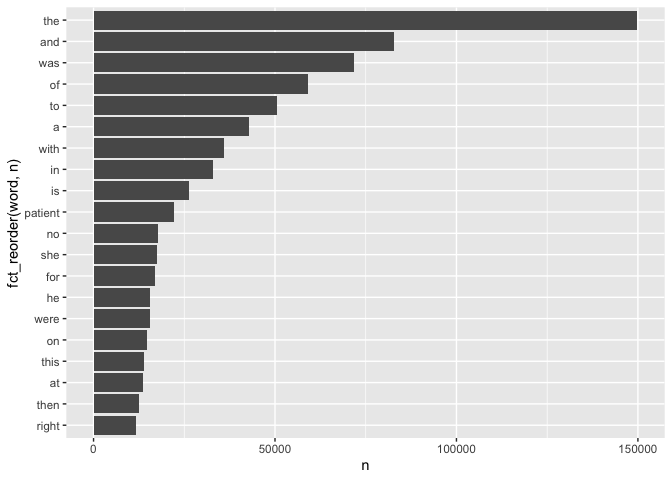

LAB6
================
Caroline He
10/1/2021

# Lab 06： Text Mining

``` r
knitr::opts_chunk$set(echo = TRUE)
```

## Learning goals

-   Use unnest\_tokens() and unnest\_ngrams() to extract tokens and
    ngrams from text.
-   Use dplyr and ggplot2 to analyze text data

### Setup packages

You should load in dplyr, (or data.table if you want to work that way),
ggplot2 and tidytext. If you don’t already have tidytext then you can
install

``` r
library(data.table)
library(dplyr)
```

    ## 
    ## Attaching package: 'dplyr'

    ## The following objects are masked from 'package:data.table':
    ## 
    ##     between, first, last

    ## The following objects are masked from 'package:stats':
    ## 
    ##     filter, lag

    ## The following objects are masked from 'package:base':
    ## 
    ##     intersect, setdiff, setequal, union

``` r
library(tidyverse)
```

    ## ── Attaching packages ─────────────────────────────────────── tidyverse 1.3.1 ──

    ## ✓ ggplot2 3.3.5     ✓ purrr   0.3.4
    ## ✓ tibble  3.1.4     ✓ stringr 1.4.0
    ## ✓ tidyr   1.1.3     ✓ forcats 0.5.1
    ## ✓ readr   2.0.1

    ## ── Conflicts ────────────────────────────────────────── tidyverse_conflicts() ──
    ## x dplyr::between()   masks data.table::between()
    ## x dplyr::filter()    masks stats::filter()
    ## x dplyr::first()     masks data.table::first()
    ## x dplyr::lag()       masks stats::lag()
    ## x dplyr::last()      masks data.table::last()
    ## x purrr::transpose() masks data.table::transpose()

``` r
library(tidytext)
library(tibble)
library(ggplot2)
```

### read in Medical Transcriptions

Loading in reference transcription samples from
<https://www.mtsamples.com/>

``` r
fn <- "mtsamples.csv"
if(!file.exists(fn))
  download.file("https://raw.githubusercontent.com/USCbiostats/data-science-data/master/00_mtsamples/mtsamples.csv", destfile = fn)

mtsamples <- read.csv(fn)
mtsamples <- as_tibble(mtsamples)
head(mtsamples)
```

    ## # A tibble: 6 × 6
    ##       X description    medical_specialty sample_name  transcription   keywords  
    ##   <int> <chr>          <chr>             <chr>        <chr>           <chr>     
    ## 1     0 " A 23-year-o… " Allergy / Immu… " Allergic … "SUBJECTIVE:, … "allergy …
    ## 2     1 " Consult for… " Bariatrics"     " Laparosco… "PAST MEDICAL … "bariatri…
    ## 3     2 " Consult for… " Bariatrics"     " Laparosco… "HISTORY OF PR… "bariatri…
    ## 4     3 " 2-D M-Mode.… " Cardiovascular… " 2-D Echoc… "2-D M-MODE: ,… "cardiova…
    ## 5     4 " 2-D Echocar… " Cardiovascular… " 2-D Echoc… "1.  The left … "cardiova…
    ## 6     5 " Morbid obes… " Bariatrics"     " Laparosco… "PREOPERATIVE … "bariatri…

## Question 1: What specialties do we have?

We can use count() from dplyr to figure out how many different
catagories do we have? Are these catagories related? overlapping? evenly
distributed?

``` r
specialties <- mtsamples %>%
  count(medical_specialty)
```

There are 40 specialties

Determine the distribution

``` r
# Method 1
ggplot(mtsamples, mapping = aes(x = medical_specialty)) +
  geom_histogram(stat = "count") +
  coord_flip()
```

    ## Warning: Ignoring unknown parameters: binwidth, bins, pad

<!-- -->

``` r
# Method 2
ggplot(specialties, aes(x = n, y = fct_reorder(medical_specialty, n))) +
  geom_col()
```

<!-- -->

## Question 2

-   Tokenize the the words in the transcription column
-   Count the number of times each token appears
-   Visualize the top 20 most frequent words Explain what we see from
    this result. Does it makes sense? What insights (if any) do we get?

``` r
mtsamples %>%
  unnest_tokens(output = word, input = transcription) %>%
  count(word, sort = TRUE)%>%
  top_n(20)%>%
  ggplot(aes(x = n, y = fct_reorder(word, n))) +
    geom_col()
```

    ## Selecting by n

<!-- --> The word
“patient” seems to be important, but we observe a lot of stopwords.

## Question 3

-   Redo visualization but remove stopwords before
-   Bonus points if you remove numbers as well What do we see know that
    we have removed stop words? Does it give us a better idea of what
    the text is about?

``` r
mtsamples %>%
  unnest_tokens(output = word, input = transcription) %>%
  count(word, sort = TRUE)%>%
  anti_join(stop_words, by = "word") %>%
  top_n(20)%>%
  ggplot(aes(x = n, y = fct_reorder(word, n))) +
    geom_col()
```

    ## Selecting by n

<!-- -->

## Question 4

repeat question 2, but this time tokenize into bi-grams. how does the
result change if you look at tri-grams?

## Question 5

Using the results you got from questions 4. Pick a word and count the
words that appears after and before it.

## Question 6

Which words are most used in each of the specialties. you can use
group\_by() and top\_n() from dplyr to have the calculations be done
within each specialty. Remember to remove stopwords. How about the most
5 used words?

## Question 7

Find your own insight in the data:

Ideas:

-   Interesting ngrams
-   See if certain words are used more in some specialties then others
